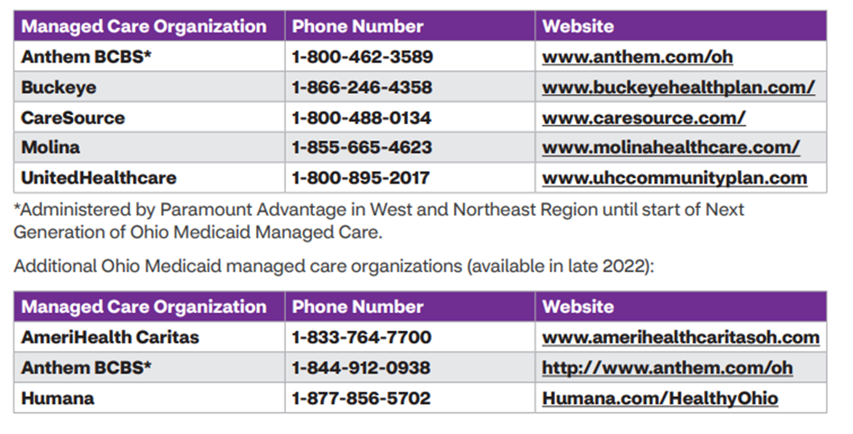

---
search:
  boost: 1
---

# MCE Contact List

## Anthem BCBS

(previously Paramount)

**Phone/Fax**:

- 1-844-912-0938 (Warm transfer)

**Hours**:

- M-F 7:00am to 7:00pm

## Buckeye - Live Agent

**Phone/Fax**:

- Member: 877-236-0307 (direct path to agent, no prompts)
- Provider: 877-236-0346 (direct path to agent, no prompts)

**Process**:

- Please note that the telephone call flow was designed so that NO prompts are required to reach a live agent. They call the number below and** the call flows directly to a live agent.

## Caresource - Live Agent

**Phone/Fax**

- 1-800-488-0134

**Process**:

- **IVR**: Prompt: Thank you for calling CareSource. Your call may be recorded to improve the service you receive.
- **IVR**: Para Español marque 8.
- **Agent Action**:  Wait for next Prompt 
- **IVR Speaks**: Are you calling as a member, a healthcare provider or a retail pharmacy?
- **Agent Speaks**: "Member" or "Provider" as appropriate
- **Agent Action**: As soon as next prompt begins, press 0 (Zero).
- **Agent Action**: As soon as IVR reprompt begins, press 0 (Zero).
- **IVR Speaks**: One moment while I connect you with a specialist who can assist you further.

Caller will then be routed, caller will potentially hear any prequeue/queue messages before reaching an agent.

**Hours**:

- M-F 7:00am to 7:00pm

## Fee-For-Fee Service (FFS)

"Regular Medicaid"

*Change healthcare is the PBM for FFS*

**Phone/Fax**:

- Technical Line: 1-877-518-1545
- PA Line: 1-877-518-1546
- Fax: 1-800-396-4111

## Molina - Live Agent

**Phone/Fax**:

- 1-855-322-4079

**Process**:

- Greeting "Thank you for calling Molina Healthcare of Ohio
- SSIVR Options (Press "0") "We updated our system to make checking authorizations, claims, and eligibility faster and easier to use. Which of these can I help you with: you can say 'authorization status', 'claim status', or 'eligibility'. For all other questions, say 'other questions' or press 0."
- Availity Portal Message "Did you know that you can get your claim status, member eligibility and benefit questions answered through the Availity Essentials Portal at www.availity.com/molinahealthcare. Check it out for quick and easy access to many of your frequently asked questions!"
- Line-of-Business Menu
    - "For Medicaid - Press 1
    - For Medicare - Press 2
    - For Health Insurance Marketplace also known as the exchange - Press 3
    - For MyCare Ohio Program, also known as Molina Dual Options - Press 4
    - For Managed Long Term Services and Supports, Press 5"
- Main Menu
    - For Eligibility, press 1 
    - For pharmacy, press 2 
    - For Non-Pharmacy Claims , press 3 
    - For Authorizations and Admissions, press 4 
    - For Case Management, press 5 
    - For Contracting and Credentialing press 6 
    - For dental inquiries, press 7 
    - For all other inquiries , press 0 
    - To repeat options, press pound
- Pharmacy Menu
    - For the Pharmacy Prior Authorization Form and Fax number, press 1 
    - For Pharmacy related eligibility discrepancies questions, press 2 
    - For pharmacy prior authorization or override questions, press 3 
    - For outpatient or infused medication prior authorizations press 4 
    - To connect to the Gainwell pharmacy help desk for any technical retail claims processing issue press 5 
    - To return to the main menu, press * 
    - To repeat options, press pound

## Hours

- M-F 7:00am to 7:00pm

