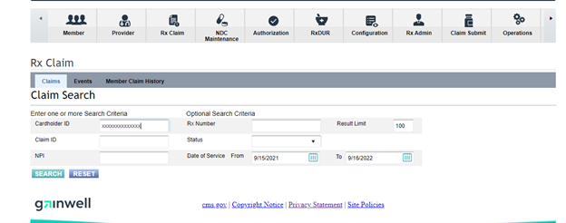
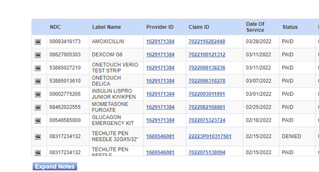
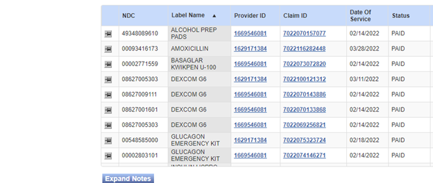
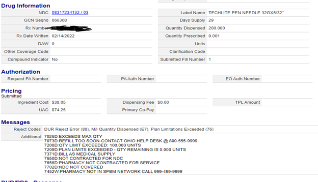
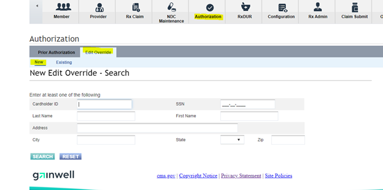
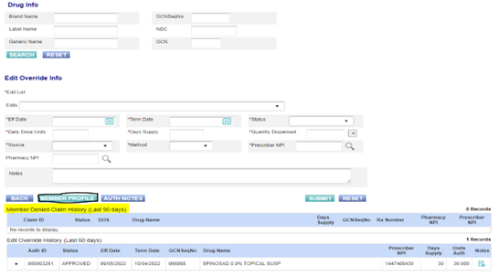
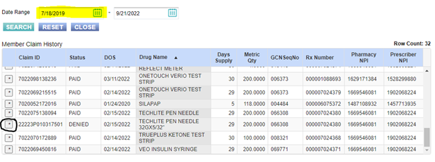
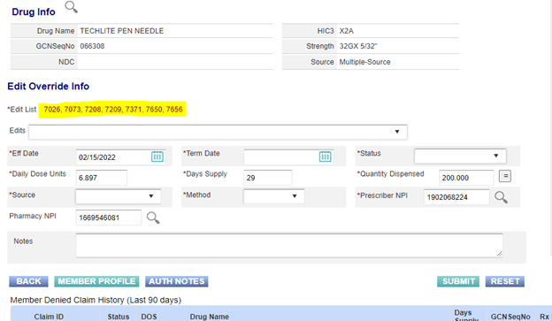
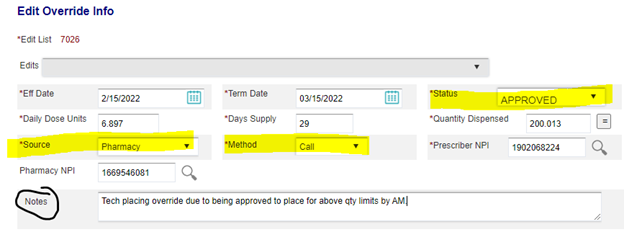

---

# Edit Override Steps

==Step 1:== To start an Edit override the tech will use the Rx Claim tile to search the member to be able to see the rejection reasons for the claim if applicable.

==Step 2:== Once the claims populate you will be able to see all rejected and paid claims, the most efficient way to search through them is to sort by drug name but left clicking on the drug name. Once you do this is will sort the drugs in alphabetical order, if multiple claims for the same drug exist it will be sorted by the most recent claim first and then in descending order to the oldest claim. You can see in the column on the right if the claim paid or not.

==Step 3:== Once you have found the claim in question you can click the thumbtack on the left-hand side to pull up either the paid or rejected details.

==Step 4:== When reviewing the rejected reasons the override numbers that end in a “D” are able to be overriden on our end, not all of the overrides that are showing should be overriden and if unsure of if you can place it reach out to either the RPH group or the Sr tech and Supervisor list depending on the situation please refer to the override questions list at the bottom of this document or in the Phone Override DLP. The edit override reasons that end in an “R” are not rejecting on our end and are instead saftey edits the pharmacy must acknoledge or place on their end.

==Step 5:== If you can place the override continue throught the rest of the steps, if an overide cannot be placed advise of correct action required, if override can be placed the best way to proceed placing the override is to select ‘edit override’ under the ‘Authorization tab’ and select ‘New’ and search the Cardholder ID. Once it is searched you can verify the member on the screen that will pop up next. (I will exclude that screen as there is no way to present it without showing member information.)

==Step 6:== Once the tech has verified the member they can check the bottom of the edit override page to see the member’s denied claim history (last 90 days). If the correct claim is not there and is prior to the 90 day window the tech can select the member profile (outlined in black marker).

==Step 7:== If the claim does not appear the tech can utilize the calendar date range to adjust it to see older claims. Once the correct claim is identified the tech can select the asterisk to pre-load drug info from the rejection.

==Step 8:== Once the claim is selected from the rejected claims the following information will loaded into the override, Drug name (by GCNSeqNo), qty/day supply, and the effective date (date of rejection). To get the term date the tech can just select the = sign next to the qty dispensed. An edit list of overrides will be auto populated based on the rejection from the pharmacy, these will not default to the correct options. The tech may need to remove certain overrides and add others based on the situation. We will know which codes we should override based on the screenshot of the rejection after step 5 and which ones you were advised to override when reaching out to your sr tech or supervisor or RPH. To remove certain overrides all you need to do is select the drop down next to edits and reselect the one/s in red that you choose to remove.

==Step 10:== Once you have populated the correct term date and chosen the overrides you wish to override you can edit your status to “Approve” (for edit overrides that you are placing the status will always be approved so that the overrides will be placed). The source and Method will be who and how they contacted you to begin the override and the last section is to add a note on why you are placing the override and if you got approval from a Sr tech, Supervisor or RPH please add their initials (First letter of both First and Last name) to the note as well. Once this is done the tech can click submit and the override is placed.

