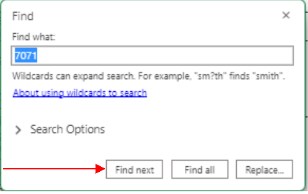
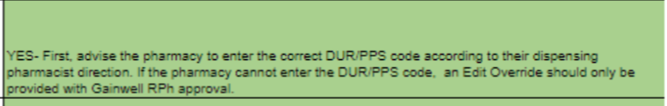
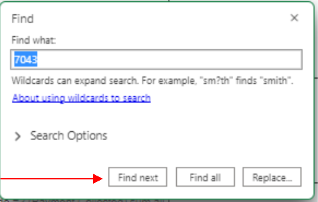
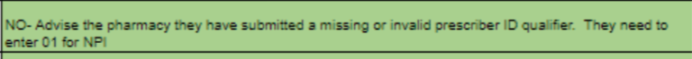

# OH Edit Settings XLS

[OH Edit Settings](https://mygainwell.sharepoint.com/:x:/t/OHSPBM/Ed_QhtgJNkVKg7Jr32scXgkB-A4jTB0kjTVSrQi8I6lLZg?e=VedSxd){ .md-button .md-button--primary target="_blank" rel="noopener"}

[OH Edit Settings XL](https://mygainwell.sharepoint.com/:x:/t/OHClinicalandTechnicalHelpdesk/EX09I3PMEIRCrFpMp5rpiB8Ba6MCMBwkU6lLxo6KyrDVDw?e=kW0iyw){ .md-button .md-button--primary target="_blank" rel="noopener"}

## How to Use OH Edit Settings

This version of the Edit.XLS document was created to eliminate the need to wait on a response in the chats for rejected claims from a Senior Technician except for those edits that indicate that RPH approval is required. Please use the spreadsheet and the designated technician function to know what to do for each edit rejection on a claim. You should not need to ask a question in the chat about what to do for a rejected claim unless the edit specifically says you need pharmacist approval.

See the examples below:

To find the edit in question- use CTRL+F – Type in the Edit # (ex: 7072)- Click Find Next

This will bring you to the line that the edit is on. Here you will find the response under “Should the Technician Override”.

In this example- You should advise them of what the response is and if the pharmacy cannot, an edit override should be provided- but only with RPH approval.

In this example- You would advise the pharmacy they need to 01 for NPI
