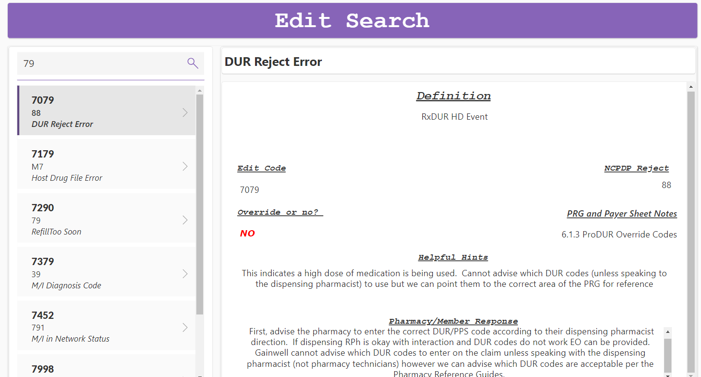

# OH Edit Tool

## Link to Edit Tool

[Edit Tool](https://apps.powerapps.com/play/e/default-c663f89c-ef9b-418f-bd3d-41e46c0ce068/a/25738e23-3f44-4fa7-a979-170d3ae8b520?tenantId=c663f89c-ef9b-418f-bd3d-41e46c0ce068&hint=75e1502e-7eae-4562-9d55-a4d0e39abd8c&source=sharebutton&sourcetime=1722967409766)

## How to Use the Tool

Once you have access to this tool you can search any Edit Override and it will tell you what the NCPDP rejection is, Helpful Hints, where you can find it in the Pharmacy Reference Guide (if applicable), a response to the caller, and you will see a visual aid in Green or Red if you can override the edit or not.

You can search by Edit number or by NCPDP reject. After putting the number in the search field hit the eye glass and then click on the edit you want to view. 

We want you to start using this immediately and if you give incorrect information on a call because you did not use the tool you will fil that evaluation, if you do not use the tool and you are correct just a note will be added to the evaluation to use the tool. 

