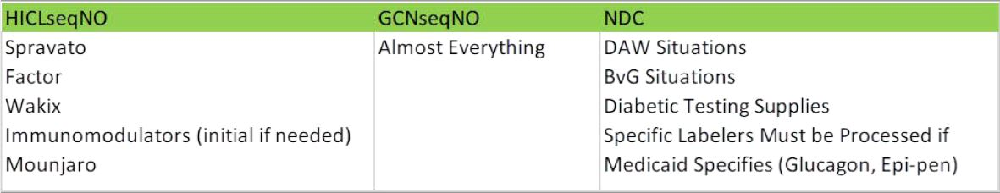

# When to select drug by HICL, GCNseqNo and NDC

## General Notes

- When working on prior authorizations, select the GCNseqNO if moving from fax view to pending or from pending to medreview. 
- **If you are to be the final decider [approve/cancel/ (deny - RPh only)], follow the HICL-GCN-NDC guidance when selecting the drug name**

### From most general to strict, it goes HICL-GCN-NDC

**HICLseqNO:**

- Use when there is going to be multiple strengths or vials used in a period
- This allows the freedom to use these vials and relies on quantity in the PA to control the amount dispensed.

**GCNseqNO:**

- What most of our approvals or denials should be.
- Allows all NDCS within a certain drug strength to pay
   - Allows all brands to pay 

**NDC:**

- Use when a specific NDC is needed to be approved or denied
- Brand vs Generic Drugs (perferred Brands)
- DAW 1 when a certain NDC is requested
- When a certain drug labeler is being approved (example  Epipen) 

### Examples

| | | 
| :--- | :--- |
| **What Format to use** | **Example Drugs**  |
|**DRUGS LOADED BY HICL**| Dupixent, Rinvoq, Adbry, Siliq, Enbrel, Simponi, Kineret, Skyrizi, Otezla, Sotyktu, Taltz, Stelara, Actemra, Tremfya, Cibinqo, Humira, Cimzia, Factor PAs, Cosentyx, Spravato, Ilumya, Mounjaro, Kevzara, Growth hormones, Olumiant, Orencia, Brand Drugs with multiple dosages (Synthroid 100mcg 6 days a week, and 125 mcg one day), Synagis 100 and 50 vials when using a dosage between 100 and 150 to use both vials to get dosage  |
|**DRUGS LOADED BY NDC**  | Brand vs Generic Drugs (perferred Brands) , Omnipod, Divigel, Infectious Disease Agents: Antibiotics - Inhaled, Epogen, Breo Ellipta, Daliresp, Brovana, Elidel, MItigare, Pennsaid, Butrans, Vascepa, Tracleer, Qudexy, Trokendi XR, Zioptan, Viibryd, Daytrana, Latuda, Saphris, Xyrem, Semglee, Elestrin, Estrogel, Dexilant, Timoptic, Intelence, Restasis Trays, Tobradex ST, Selzentry, Specific Testing supplies being requested (freestyle products vs one touch). |

