# Additional Info Chat

Step by step directions when working out of the additional info chat

[Additional Info Chat Document](https://mygainwell.sharepoint.com/:w:/r/sites/OHMCD/SPBM%20Workspace/Training%20%26%20Quality%20Assurance/Evergreen%20Documents/Additional%20Info%20Chat%20Scenarios%20-%20Updated.docx?d=w83722b630a284f34b2c429074cea4240&csf=1&web=1&e=DcJCS1){ :target="_blank" rel="noopener" }

Step 1: Copy and paste the Auth ID Number and place it in the existing field.  
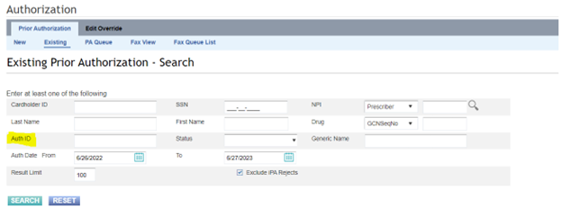

Step 2: Open the PA Document and compare the fax number (This step is done to ensure the fax is being sent to the correct destination as well as to ensure we are not sending HIPAA information to the wrong fax number/office).

Step 3: Insert the information in the designated Note Section.  
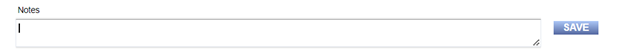

**There are a variety of scenarios in which information is placed in the note section that provides information on why the mentioned Auth ID has been cancelled.**

Step 4: Once the note section has been filled out, the information is then placed in the "Reject Fax Letter Template"  
[Reject fax Template](https://mygainwell-my.sharepoint.com/:w:/g/personal/jessica_cain_gainwelltechnologies_com/EbwJe79pnD5GqMnKP4RYX6kBChL7cN0m9Nlv7hZCz6MuuA?e=L8uI5U){ :target="_blank" rel="noopener" }

Step 5:  
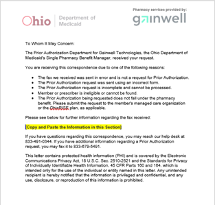

Step 6: Once the Document has been saved as the standard Word Document, it must then be saved as a PDF Document. This is the only way the document can be attached to the PA through Process Manager.  
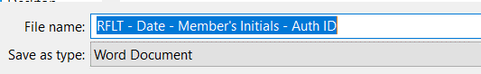

Step 7: Requires the use of Open Text  
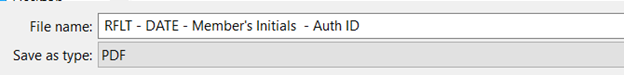

Step 8:  
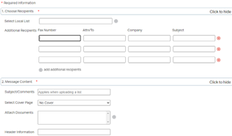  
In this section, the opportunity to review the fax number as well as the documents being sent are reviewed.  If the information is exactly that it should be, the document can then be sent.  A Job #: is then provided once the fax has been sent.  
An email is generated and will provide information regarding result of the fax.  
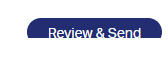  
^^The highlighted values are the most common results that are faxed back.^^  
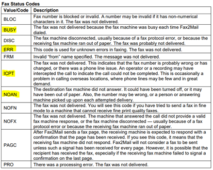 

Step 9: The Reject Fax Letter Template should then be attached to the existing Auth ID through Process Manager.  
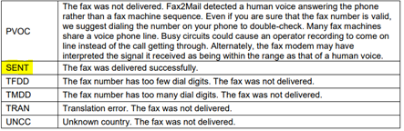  
- A new tab will populate with the Vue360Rx sign in request will pop up.
- Sign in with the same username and password used for Vue360Rx (HCLS=LEV/shortname).  
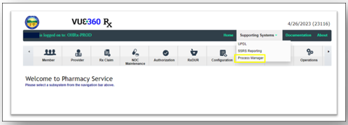   
- Click on Process Manager Web Button to the left.  
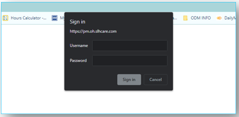  
- To upload a PA, click Document Publisher
- CHange the Filter Criteria to SPBM_PriorAuth  
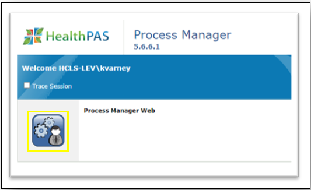

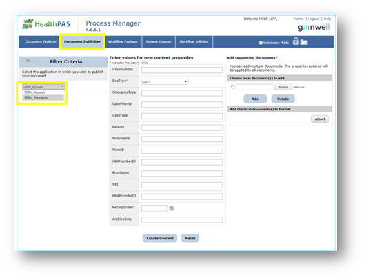

**The status is always "LINKED"  
***The Member's last name reads as [Last Name, First Name]  
****The document must be a PDF file when attaching through Process Manager.

Once the required Fields have been filled out, and the document has been attached, click create content and it is then added to the “PA DOCS” Section.  
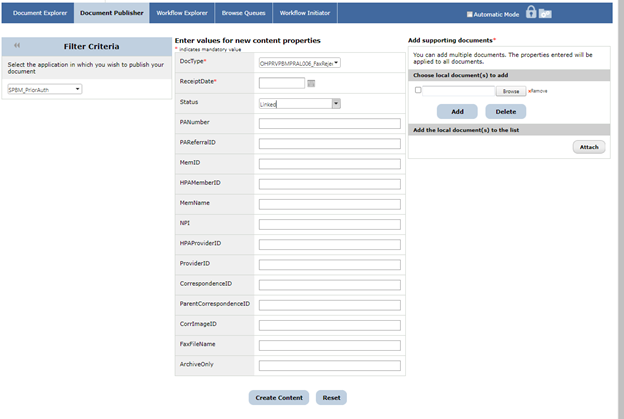
