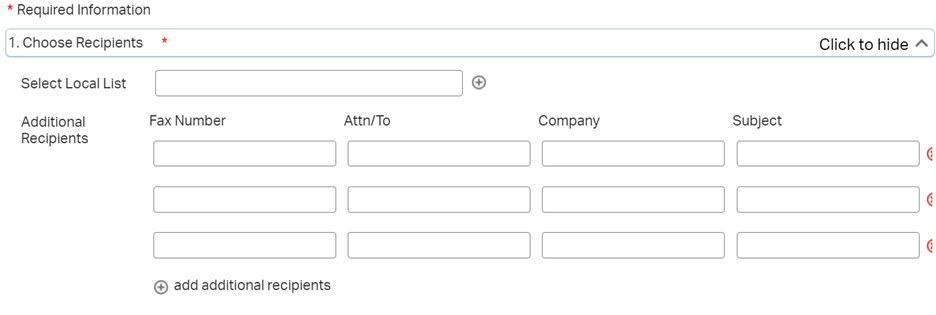
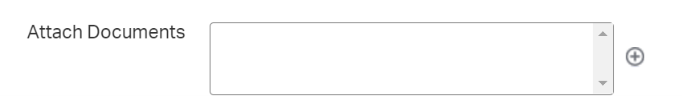
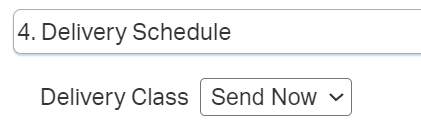

# Cancel and Not Required Process

## Reject Fax Templates

| | |
| :--- | :--- |
| Fax Received in Error | The fax request for {Member Name, DOB and Medicaid ID#} was received but was sent in error and is not a request for a Prior Authorization. |
| Incorrect Form | The Prior Authorization request for {Member Name, DOB, Medicaid ID#, and Drug Name} was sent in using the wrong form. Please utilize the Gainwell {Name of Form} and resubmit. |
| PA Form Incomplete | The Prior Authorization request for {Member Name, DOB, Medicaid ID#, Drug Name} is incomplete and is missing the following: {missing info}. |
| Member or Prescriber not Eligible | The Prior Authorization request for {Member Name, DOB, Medicaid ID#} cannot be processed as the {member or prescriber} is ineligible or cannot be found. |
| Not a Pharmacy Benefit | The Prior Authorization request for {Member Name, DOB, Medicaid ID#} does not fall under the pharmacy benefit, please submit the request for {Requested Service} to the member’s managed care organization or the Ohio RISE plan, as applicable. |
| Duplicate | The fax request for {Member Name, DOB and Medicaid ID#} was received but there is already an approved Prior Authorization on file for {Drug name and Strength} until {Term Date}. |
| Prior Authorization Not Required | The fax request for [Member Name, DOB and Medicaid ID#]  was received but the request does not require a Prior Authorization. |
| Brand Preferred over Generic | The following medication [xxxx] has been requested for your [Member Name, DOB and Medicaid ID#]. The plan covers the brand name medication [xxxx] without a prior authorization. Please have the pharmacy process the brand name medication using a DAW 9 when processing the prescription. If the non-preferred medication (the medication that is NOT covered by the plan) is required, please re-submit the prior authorization request for review with a statement that the non-preferred medication is being requested and include the clinical reasons that the preferred medication cannot be used. | 
| Wrong Medicaid ID | The Prior Authorization request for {Member, DOB, ID number used on form, Medication} is incomplete and is missing the following: Correct Medicaid ID. Starting 2/10/2023, Gainwell Technologies SPBM will no longer accept PAs without the correct 12-digit Medicaid ID. Please resubmit with the correct Medicaid ID. |

### Reject Fax Template

[Reject Fax Template](https://mygainwell-my.sharepoint.com.mcas.ms/:w:/g/personal/jessica_cain_gainwelltechnologies_com/EbwJe79pnD5GqMnKP4RYX6kBChL7cN0m9Nlv7hZCz6MuuA?e=L8uI5U){:target="_blank" rel="noopener"}

### Faxing a Reject Fax Process

[Faxing a Reject Fax to Cancel a PA in the PA Queue](https://mygainwell-my.sharepoint.com/:w:/g/personal/kaelyn_dobbins_gainwelltechnologies_com/EdecAOUIQB9FrG4x_QsjAAgBjXos8-nsfhqsSG9i83JqEQ?e=9iwXbj){:target="_blank" rel="noopener"}

When working from the PA Queue, you may come across PA’s that need to be cancelled for the following reasons:

- Member not eligible/Member has FFS
-	Not a Pharmacy Benefit/Needs to go through Medical
-	Duplicate PA on file

In these cases, you will need to use the “Reject Fax” and complete the form by using the “Reject Fax Templates” located in the “Ohio Pharmacy Call Centers Notebook” in OneNote. 

Before sending your fax, please copy you Reject Fax Template documentation from the fax and paste into your Notes section on the PA and state that a fax was sent. Then change the status to cancel and hit Submit.

Once you have prepared the Reject Fax with proper documentation, you should save the document to your One Drive. Now you can send the fax using Open Text. [https://myportal.opentext.com/XddsPortal/](https://myportal.opentext.com/XddsPortal/){:target="_blank" rel="noopener"}

-	Use Gainwell email as username and reset password if you don't have it
-	Add appropriate Fax Number below Additional Recipients

-	Upload your Reject Fax by clicking on the plus sign next to the Attach Documents box

-	Choose Send Now for Delivery Schedule

-	Then click on Review & Send in the top right corner and then Submit
-	You can then go to Check Job Status to make sure your fax goes through

## Items to consider prior to canceling:
 1.	Does the signature follow the guidance provided on Evergreen?
    
 2.	Is the ICD-10 code provided? If not, is the diagnosis code provided on the PA form or within the chart notes? If yes, please use the search function on the PA screen to choose the most appropriate diagnosis code.
       
 3.	Is the request for a BvG medication? Always check the rejected claims to see what the pharmacy is submitting for.
     
 4.	Duplicate requests
      a. -	A duplicate request is only considered a duplicate if the request is for the exact same medication, dose, frequency as a request previously submitted and approved on the same day. If the request comes through on a different day (example – the next day), this is to be reviewed as a new request, and not a duplicate.

     - Internal template used for cancelled cases should include at minimum: Reason for cancellation, job # within OpenText, fax # cancelled fax was sent to, date and time that cancelled fax was successfully sent via OpenText. In addition, the outbound fax communication MUST be uploaded through Process Manager and attached to the cancelled PA.
   
## Items to consider prior to sending back as “PA Not Required”:

1.	Have you checked the rejected claim to see why the provider is submitting a PA? Does the medication truly need a PA or just an edit override?

2.	Have you verified that the request is not for a BvG medication?

3.	Have you verified that the request does not exceed any quantity limits or age restrictions per the UPDL?
