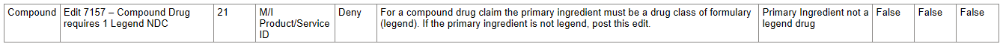
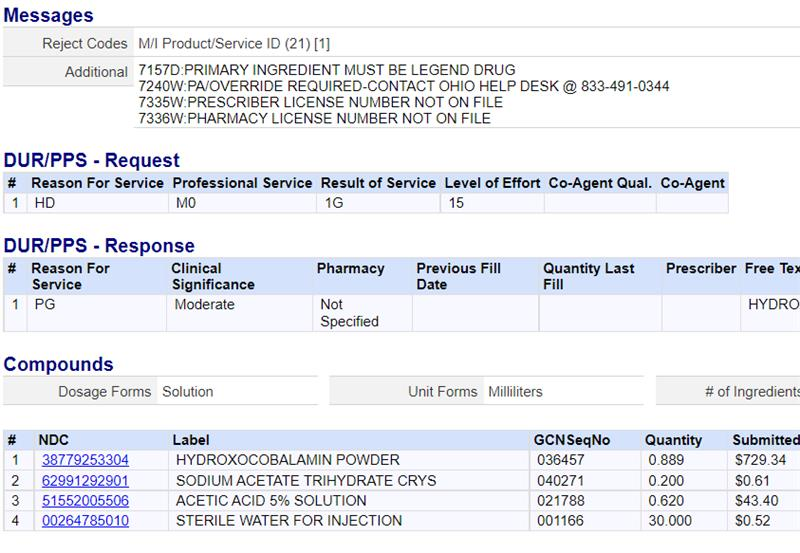
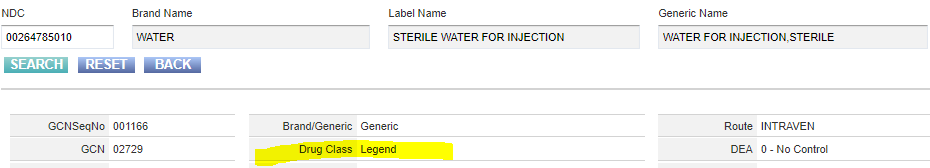
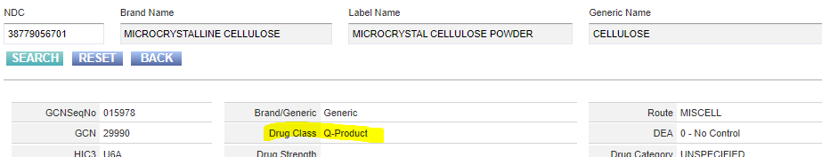

---
search:
  boost: 1
---

# Compounds

[Desk Level Procedure Compounds without preferred language](Desk Level Procedure Compounds without preferred language.docx){target="_blank" rel="noopener"}

## No PA required on specific Compounds 7/28/23

If below ingredients are the primary ingredient in the compound, they should no longer be hitting for PA required (most likely will not be until next week or the following that they will no longer reject for PA needed). **Until these ingredients are loaded in the system, please ^^approve^^ the below ingredients on compound requests.**

Cassandra Roach, PharmD, RPh

ODM wants to provide notice that next week, CHC will be removing PAs from several injectable and powder ingredients commonly used in compounds. You will see this come over in next week’s file and this should decrease the amount of PAs you may be seeing for these common compounds. These include:

**Compounds no longer requiring PA:**
| |  |  | | |  |
|--------------|-----------|--------------|---|--|--|
| cefepime |cefotaxime | cefotetan | ceftazidime | cefuroxime | clindamycin |
| acetaminophen | amitriptyline|ciprofloxacin| enalapril| ketoprofen| cefazolin|
|ceftriaxone| piptazo| ampicillin| ampicillin sulbactam| NS| D5|
|diphenhydramine| promethazine| ondansetron| famotidine| amantadine| boric acid|
|cellulose| cyclobenzaprine| doxepin| estradiol| estriol| lidocaine| 
|meloxicam| methocel| metronidazole| pentoxifylline| progesterone| sodium bicarb| 
|testosterone| ubiquinol| zinc gluconate| zinc sulfate| vancomycin | lansoprazole IV and powder| 

Yana Doughty, PharmD

## Compounds: 

[20220701_Payable_Active_Pharmaceutical_Ingredients_and_Excipients_for_Compounding.pdf (ohio.gov)](https://pharmacy.medicaid.ohio.gov/sites/default/files/20220701_Payable_Active_Pharmaceutical_Ingredients_and_Excipients_for_Compounding.pdf#overlay-context=drug-coverage){target="_blank" rel="noopener"}

Must do a PA for each ingredient in the compound in order to approve it, check claim to see which ones rejected to do EO on those as well (???)

How to Enter a Compound in a PA: (???)

**Multi-Ingredient Compounds Criteria From Medical Necessity Policy:**

Multi-ingredient compounds will be considered medically necessary when all the following criteria are met:

1. The primary active ingredient in the compound is a federal legend drug and 
2. The active ingredients are prescribed in therapeutic amounts based on FDA approved indications and 
3. If a compound is similar to a commercially available product but differs in dosage, dosage form, or inert ingredient, chart notes are required from the prescriber supporting the need for the compound (i.e., documented difficulty or inability to swallow oral dosage forms, documented allergies to inactive ingredients) and 
4. If any ingredient in the compound, active or inactive, otherwise requires prior authorization, the member must meet criteria established for medical necessity for that ingredient **and** 
5. The member has tried and failed a 30-day trial with **all** preferred medications that can be used to treat the member’s condition.  

Compounds will not be covered under the following circumstances:

1. The compound does not contain a federal legend drug covered by the plan or  
2. The compound is being used for cosmetic purposes, performance enhancement, obesity, sexual dysfunction, infertility, investigational or experimental use or  
3. The compound is for a product that is commercially available or  
4. The compound is for convenience purposes only. 

The following compounded preparations are not considered medically necessary as they have not been proven to be more effective than commercially available products:

1. Compounded implantable hormone replacement pellets or granules (i.e., estrogen-based implantable pellets)  
2. Bioidentical hormones 
3. Topical compounds containing baclofen, gabapentin, and ketamine 

7157- first billable ingredient needs to be a legend drug

[https://casetext.com/case/exeltis-usa-inc-v-first-databank-5](https://casetext.com/case/exeltis-usa-inc-v-first-databank-5){ .md-button .md-button--primary target="_blank" rel="noopener"}

F – Prescription drugs or medical devices as defined in the Food Drug and Cosmetic Act (FDCA), including bulk drug ingredients

O – Non-prescription drugs or medical devices

Q – **Products** that are neither drugs nor devices, such as dietary supplements (including prenatal and other vitamins), medical foods, herbal preparations, and bulk flavorings or colorants.

Will add that for now while it is in the works:

Good morning Janelle,

We received approval from ODM yesterday to change the edit, 7157, that was denying OTC compounds.  The previous requirement was for 1 legend ingredient to be included.  ODM agreed to set this claim to “Ignore” from a “Deny”.

This was done yesterday by the product team, so I’m hoping that the claim will be able to be processed today.

Please let me know if there are further questions/concerns and also let me know the end result to make sure the claim is paid and we have taken care of the patient.

Thank you for bringing this to our attention as well as to ODM, Scott
