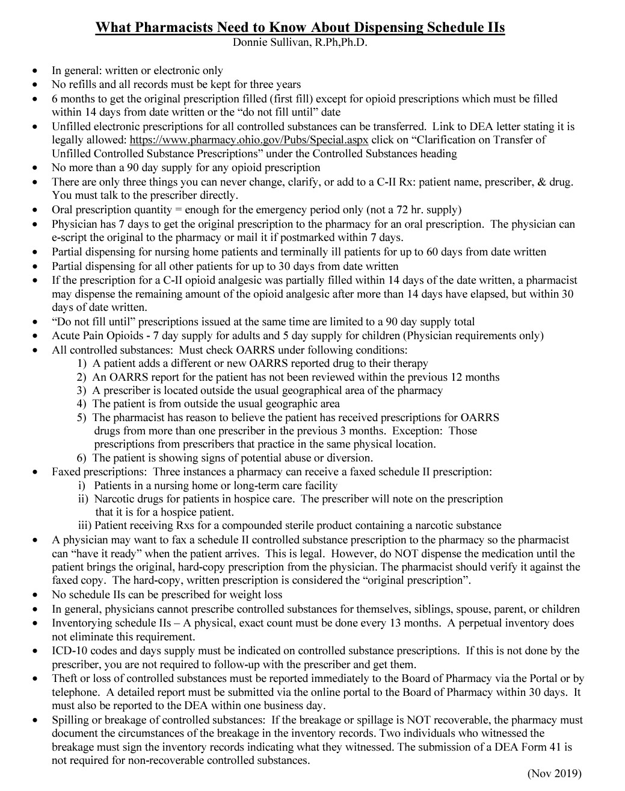

---
search:
  boost: 1
---

# Ohio Rx laws

Information can also be found in the provider reference guide.

**OH Prescription length Laws:**

- CII (Narcotic) - 14 days from date written (partial fill must be completed within 30 days) 
- CII (Non-narcotic) - 6 months (partial fill must be completed within 30 days) 
- C3-5 - 6 months, Non-controlled Rx - 1 year.  

All Non-CII Rxs must be have 1st fill within first 6 months from date written.

