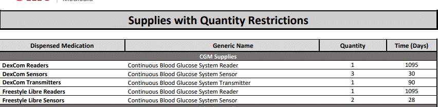

---
search:
  boost: 1
---

# Dexcom 10/15/22

The only thing if I may add is that ODM pays for the Receiver or reader every 3 years so I put a 1095 day supply on it.
 
- DexCom, Inc. 08627-0091-11 DexCom G6 Receiver – this is only needed one time per year ((Indicated for one-year use)

This is on the OHUPDL Diabetic Supply List with the following criteria:
 
The following practice standards warrant CGM usage:
 
- Must have had appointment with provider within past 6 months AND
    - Diagnosis of type 1 diabetes OR
	- Diagnosis of type 2 diabetes and require insulin dose adjustment within the last 12 months, or have significant
	inability to adequately monitor blood glucose via fingerstick, or not require prandial insulin with A1c >7% OR
	- History of significant or recurring hypoglycemia
	 
- When approving, use the NDC provided:
	 
	- DexCom, Inc. 08627-0016-01 DexCom G6 Transmitter – (Indicated for three-month use) (refill every 3 months)
	- DexCom, Inc. 08627-0053-03 DexCom G6 Sensor – 1, 3-pack of Sensors: With a 10-day sensor life, patients will need to replace sensors every 10 days - refill every 30 days
    - DexCom, Inc. 08627-0091-11 DexCom G6 Receiver – this is only needed one time per year ((Indicated for one-year use)

Reference - [https://provider.dexcom.com/education-research/clinic-resources/prescribing-info/how-fill-dexcom-g6-pharmacy-prescription](https://provider.dexcom.com/education-research/clinic-resources/prescribing-info/learn-how-fill-dexcom-g6-pharmacy-prescription){:target="_blank" rel="noopener"}
