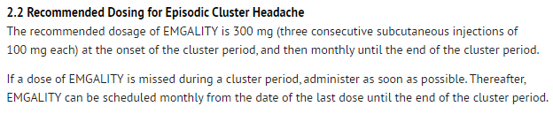

---
search:
  boost: 1
---

# Emgality for training 4/19/23

Hello,

It has been clarified that when approving Emgality for cluster HA, we are to allow 3 doses of 100mg every month for 180 days.
The main point of this clarification is that this portion of the UPDL is going to be change on 4/19/23, to better reflect the indicated dosing

This will be changed to 3 every 30 days for the entire life of PA
 
It still must follow the cluster headache criteria, we will see big doses of the 3 of 100 a month, which we will need to approve the PAs for and make sure it is able to go through with EOs if needed. It does have a specific package that is appropriate for this administration:

This is to be done all 3 at once, with dosing given to be 180 days

The daily dose portion would be 3/30 = .1, the days supply would be 180
 
Per the criteria they would still need to try diltiazem

If any questions please let me know, 

Thanks,

Justin
