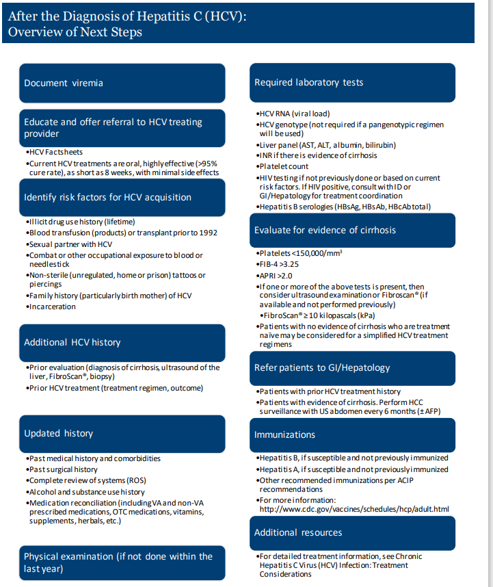
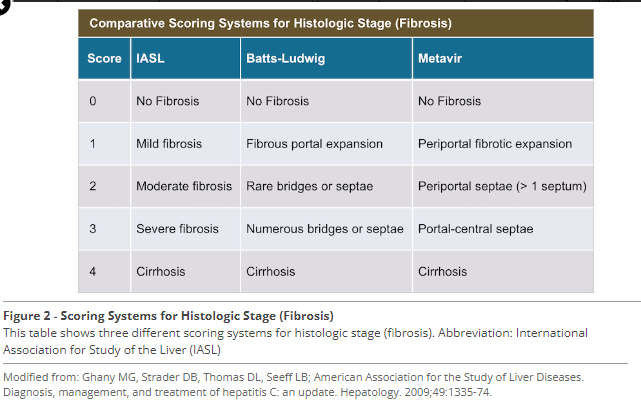
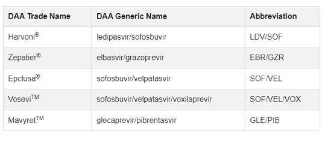
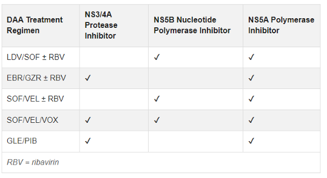

---
search:
  boost: 1
---

# Hepatitis C

Dosing Guidance:

[Recommendations for Testing, Managing, and Treating Hepatitis C | HCV Guidance](https://www.hcvguidelines.org/){:target="_blank" rel="noopener"}

**Viral Load Testing:** 

Prior to initiation of antiviral therapy, quantitative HCV-RNA testing should be used to determine the baseline level of viremia (ie, viral load), which may affect treatment duration with certain regimens. The degree of viral load decline after initiation of treatment is less predictive of sustained virologic response (SVR) in the era of direct-acting antiviral (DAA) therapy compared with previous interferon-based treatment 

**The quantitative HCV RNA test is checked before a patient starts treatment.**

For each patient, the result can be described as either a "high" viral load, which is usually >800,000 IU/L, or a "low" viral load, which is usually <800,000 IU/L. It's not uncommon to have a viral load in the millions. Today's hepatitis C treatments are very effective with both high and low viral loads. An undetectable HCV viral load 10-12 weeks after hepatitis C is completed is associated with a cure.

HCV RNA tests must have an LLOQ of 25 IU/mL or lower when used to assess treatment response with DAAs.

***Liver Fibrosis:***

***FIB-4***

[Assessing Liver Fibrosis Using the FIB4 Index in the Community Setting](https://www.ncbi.nlm.nih.gov/pmc/articles/PMC8700445/){:target="_blank" rel="noopener"}

The primary outcome was the number of individuals within each risk category for hepatic fibrosis: high risk (FIB4 ≥ 3.25) and low risk (FIB4 < 1.3).

***Treatment Drugs:***
DAA drug classes include NS5A polymerase inhibitors, NS5B polymerase inhibitors, and NS3/4A protease inhibitors.

Patients with no evidence of cirrhosis who are treatment naïve may be considered for a simplified HCV treatment regimen.

First line HCV DAA Medications: 

HCV DAA Treatment Regimens by Class:  

**Treatment Naïve:**

RAV testing is occasionally done in treatment-naive patients if it may change the regimen or the duration of treatment.

Ex: genotype 1a patients who are treatment naive should be RAV tested before starting treatment with elbasvir/grazoprevir to determine whether ribavirin is needed or whether an extended duration of treatment is needed.

**Treatment Experienced:**

RAV tests are done in most patients who have failed a prior DAA-containing regimen before they initiate re-treatment w/ another DAA regimen.

Ex: genotype 3 patients are recommended to have RAV testing if they are treatment experienced before starting re-treatment with sofosbuvir/velpatasvir and to determine whether ribavirin is needed.

Acronyms:
- CTP - Child-Turcotte-Pugh
- DAAs - direct-acting antivirals
- EIAs - enzyme immunoassays (tests used for detecting HCV ab)
- GT - genotype
- HAI - Histological activity index or Knodell score (scoring system for fibrosis)
- HCC - Hepatocellular carcinoma
- LLOD - the lowest level of HCV RNA that is detected ≥95% of the time.
- LLOQ - the lowest HCV RNA level that is within the linear and analytically acceptable range of the assay.
- RAVs - resistance-associated variants (Hep C virus strains that have resistance due mutations of some proteins)
- RAPs- resistance-associated polymorphisms
- RFLP - restriction fragment length polymorphism (used to test the HCV RNA to establish genotype)
- SVR - sustained virologic response

