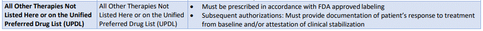

---
search:
  boost: 1
---

# High Cost Edit

Hello, 

Further clarification has been given in the high cost edit firing situations.

Currently I believe this will trip with the cost of a claim is greater than $10,000

In guidance it has been clarified that cost edit will clinically supersede preferred status, in that if this edit trips for a claim, a PA is required.

In the PA criteria of the medication, the UPDL should be the first place to check for criteria, if not then stated approve PA by label, which means to approve based on the additional classes criteria sheet:

This should review indication, age, dosage, monitoring, if other therapies must be used prior, etc.
 
In receiving these PAs processing is as such:

**Non-Preferred medications** – PA edit does cover cost per approval, and if programmed to trip for high cost will be ignored in PA is in place, as in claim comes in-system sees non-preferred:does this need a PA? Yes – is there a PA in place? Yes – approve claim, ignore cost edit that is later than PA edit in importance. Our regular PA processing protocol should be followed.
 
**Preferred** – Will need an approved PA for documentation(not technical) purposes of validity(clinical appropriateness) of use AND technical uses of processing an edit override. This is because the system recognizes that no PA is required as in; claim comes in-system sees preferred:PA required? NO – high cost edit? Yes – claim rejected.

So we would need to approve the PA, and enter the EO for the life of the PA.
 
**So Processing is as follows:**

**Non-preferred** that is above cost: Apply UPDL criteria, if none approve per FDA labeling, no additional EO required.

**Preferred** that is above cost: Apply UPDL criteria, if none approve per FDA labeling, PLACE EO FOR LIFE OF PA (30, 180, 365 days what is appropriate)
 
Common situation=

Q - A technician gets a call from a pharmacy, it is a preferred medication, but claim is stopped due to high cost of $10,000.

A – A PA is required since the cost edit was tripped.

**PLEASE Be aware, every instance is different, and there may be legacy PAs, lapse in PA coverage, past successful claims, anything indicating that the refill is warranted, for these situations I would strongly suggest a one month extension to get PA on file and approved while not depriving member of medication. DOCUMENT WELL, USE YOUR CLINICAL JUDGEMENT, please remember to do what would be best for the member to a point where prior authorization can be submitted and approved**
 
Please Ask if any confusion or questions,

Thanks all 

Justin Collingwood
