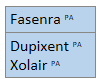
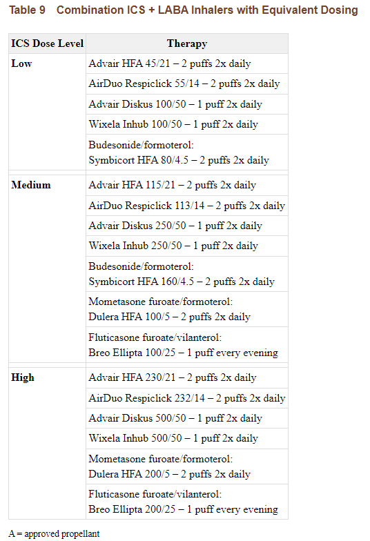

---
search:
  boost: 1
---

# Respiratory Agents: Monoclonal Antibodies-Anti-IL/Anti-IgE 

For Asthma – Must have had uncontrolled asthma symptoms and/or exacerbations despite at least 30 days with:   
- Medium dose preferred ICS/LABA inhaler for 6 years and older OR medium dose preferred ICS/LABA inhaler with tiotropium or high dose ICS/LABA inhaler if 12 years and older  

