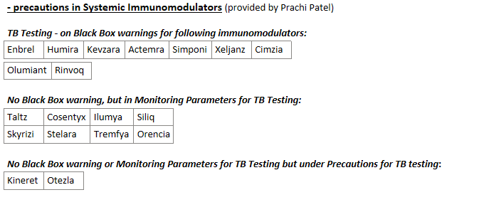
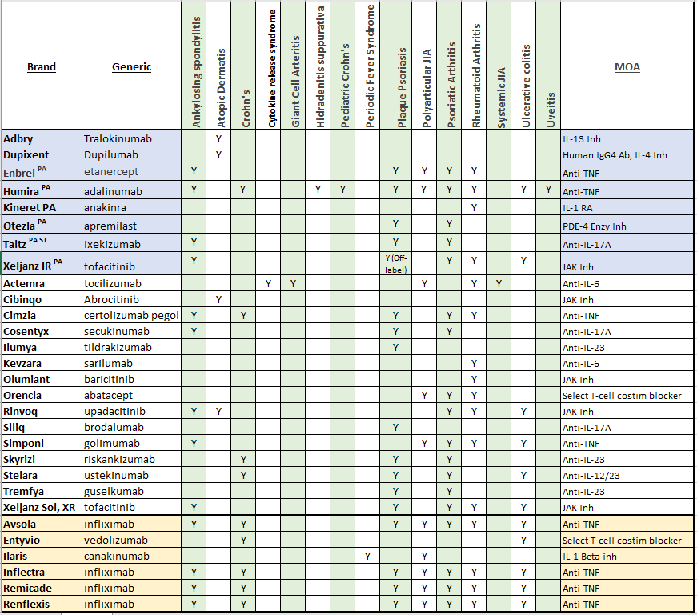

---
search:
  boost: 1
---

# Systemic Immunomodulators

By Chris for 1/2023 UPDL: Immunodoluators by Dx.xlsx

***No Preferred agents with the indication for the treatment of Giant Cell Arteritis (Actemra) or Alopecia (Olumiant)***

**Diagnosis on chart are for the most common indications. The medications may have other indications (not listed below) and would need to be verified on Lexicomp or other clinical resources  

## Stelara Dosing 7/26/23

Stelara (ustekinumab) has been shown to be effective for treatment of ulcerative colitis (UC) and Crohn’s disease. Unfortunately, a large percentage of patients (>40% for UC; approximately 50% for Crohn’s) achieve suboptimal clinical response after induction and maintenance dosing of every eight (8) weeks. 

Current literature does indicate that dose intensification to every four (4) or six (6) weeks is a viable option in those patients who do not achieve clinical response at 8 weeks (Clin Gastroenterol Hepatol. 2022 Oct;20(10) 2399-2401). This has also been supported by Gainwell Medical Directors. When reviewing requests for dose intensification, if the prescriber has indicated a sub-clinical response at standard dosing, and wishes to intensify to more frequent dosing, then please consider approving. 

7/21/23: **There is literature to support every 4 weeks dosing in certain cases of Crohn’s / UC.**

Anthony J. Beisler, MD, MBA, FACS, FABQAURP, CHCQM 

## STATE OF WEST VIRGINIA DEPARTMENT OF HEALTH AND HUMAN RESOURCES BUREAU FOR MEDICAL SERVICES

## Possible First Line Agents by Diagnosis 

[Humira Decision Tree see section 1000](https://special-spoon-f542dccd.pages.github.io/Pharmacist%20Reference%20Guide/Decision%20Pathways/Humira/)

This is the link for [Journal of the American Academy of Dermatology - Guidelines of care for the management of atopic dermatitis](https://www.jaad.org/article/S0190-9622(14)01257-2/fulltext#secsectitle0010){ :target="_blank" rel="noopener"}
– RCarpenter RPH
