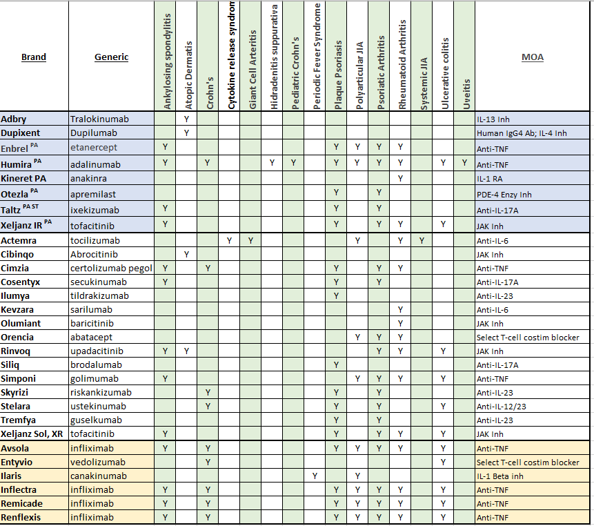
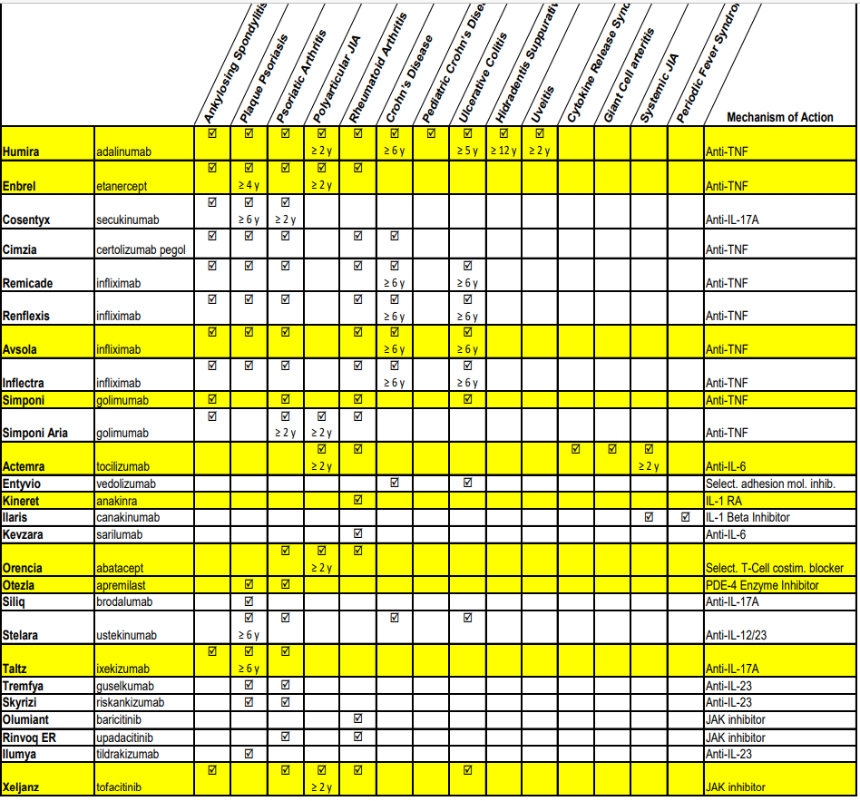
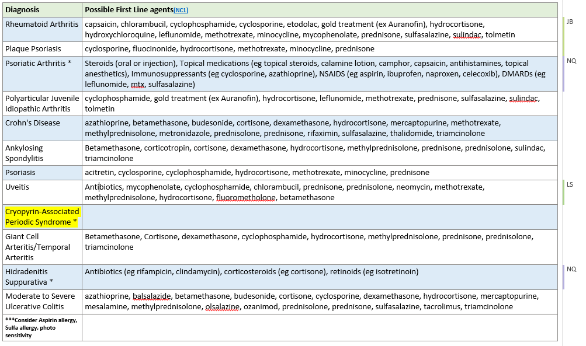

---
search:
  boost: 1
---

# Systemic Immunomodulators

By Chris for 1/2023 UPDL: Immunodoluators by Dx.xlsx

***No Preferred agents with the indication for the treatment of Giant Cell Arteritis (Actemra) or Alopecia (Olumiant)***

STATE OF WEST VIRGINIA DEPARTMENT OF HEALTH AND HUMAN RESOURCES BUREAU FOR MEDICAL SERVICES

Possible First Line Agents by Diagnosis (Provided by Brian Johnson/Chris Nguyen)

This is the link for [Journal of the American Academy of Dermatology - Guidelines of care for the management of atopic dermatitis](https://www.jaad.org/article/S0190-9622(14)01257-2/fulltext#secsectitle0010){ :target="_blank" rel="noopener"}
– RCarpenter RPH
