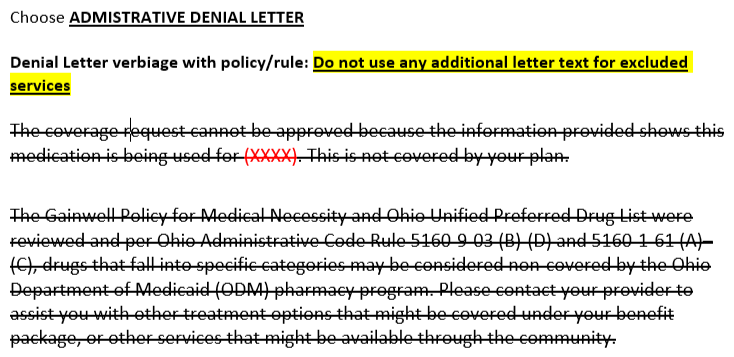

# Medications Not Covered by ODM

Exception: EPSDT

***5.2.11 Medications Not Covered***

Drugs that fall into one of the following categories are non-covered by ODM:

- Drugs for the treatment of obesity;
- Drugs for the treatment of infertility;
- Drugs for the treatment of erectile dysfunction;
- DESI (Drug Efficacy Study Implementation) drugs or drugs that may have been determined to be 
identical, similar, or related;
- Drugs that are covered or are eligible to be covered by Medicare part D, when prescribed for an 
individual who is eligible for Medicare, unless Medicaid coverage is provided for a dual eligible as 
designated at: https://spbm.medicaid.ohio.gov;
- Over-the-counter drugs that are not listed at: https://spbm.medicaid.ohio.gov;
- Drugs being used for indications not approved by the Food and Drug Administration unless there 
is compelling clinical evidence to support the experimental use, or;
- Drugs provided by sanctioned providers.

Non-Covered Services (treatment of infertility, weight loss, erectile dysfunction, etc.)

