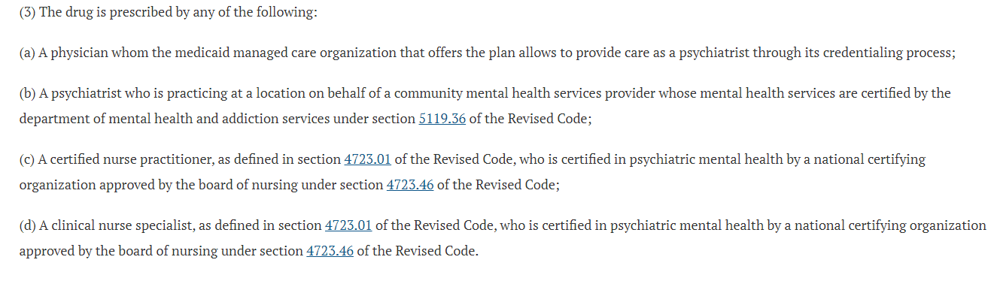

---
search:
  boost: 1
---

# Psych Exemption 

## Working in a mental facility does not give automatic Psych Exemption 8/22/23

Hello!

As discussed below for further information on psych specialists – 

For now, to get automatically approved as defined by the IPA rule in place for the exemption, for systemic look back and approval to qualify prescriber must be registered with ODM as a specialist.

For purposes of if not registered, when considering this statement – 

**Psychiatrist Exemption**

Prescribers (as identified below) are exempt from prior authorization of any non-preferred antidepressant, or step therapy of any preferred drug, in the standard tablet/capsule dosage forms. Other dosage forms may still require prior authorization. The exemption will be processed by the claims system when the pharmacy has submitted the prescriber on the claim using the individual national provider identifier (NPI) for the prescriber.

We can gather that if ==specialist by other registration (NPPES) that they are indeed a psych specialist==, if a standard dosage form and not rejecting for other things like quantity or other edits that apply, they do ==qualify for psych exemption==.

As directed before, if someone is ***not registered anywhere as a specialist, but works in a mental health situation, this does not make them a specialist.*** BUT please be aware, if a member is going to one of these places, there is a high probability that they have seen a specialist, and if further information is gathered that has happened, please use your clinical judgement to determine appropriateness of the situation.

Thanks!

Justin

## Pysch Exemption does not Override DAW 2/7/23

Hello,

I did reach out to clinical to see how the Psych exempt DAW should be considered, it appears that brand is not considered the step therapy portion of the part, described below.

Thanks,
Justin

