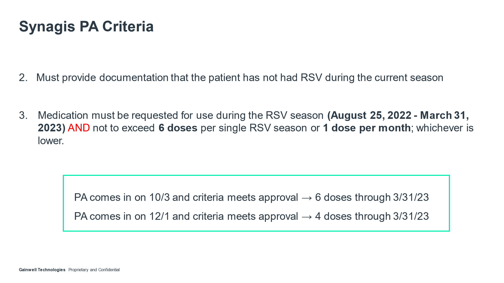

---
search:
  boost: 2
---

# Synagis Training

## Synagis Uptraining 9/27/23

[Synagis Uptraining Email](https://mygainwell-my.sharepoint.com/:u:/g/personal/christopher_nguyen_gainwelltechnologies_com/EZ42ZwzGB6hDk2xIv4AjoPYB9muLVgWDxCDtkFqEJSWsOg?e=WtUopG){ .md-button .md-button--primary target="_blank" rel="noopener"}

[Synagis Uptraining Video- 9/27/23](https://mygainwell-my.sharepoint.com.mcas.ms/personal/justin_collingwood_gainwelltechnologies_com/_layouts/15/stream.aspx?id=%2Fpersonal%2Fjustin%5Fcollingwood%5Fgainwelltechnologies%5Fcom%2FDocuments%2FRecordings%2FSynagis%20Uptraining%2D20230927%5F113424%2DMeeting%20Recording%2Emp4&nav=eyJyZWZlcnJhbEluZm8iOnsicmVmZXJyYWxBcHAiOiJTdHJlYW1XZWJBcHAiLCJyZWZlcnJhbFZpZXciOiJTaGFyZURpYWxvZyIsInJlZmVycmFsQXBwUGxhdGZvcm0iOiJXZWIiLCJyZWZlcnJhbE1vZGUiOiJ2aWV3In19&nav=eyJyZWZlcnJhbEluZm8iOnsicmVmZXJyYWxBcHAiOiJTdHJlYW1XZWJBcHAiLCJyZWZlcnJhbFZpZXciOiJTaGFyZURpYWxvZyIsInJlZmVycmFsQXBwUGxhdGZvcm0iOiJXZWIiLCJyZWZlcnJhbE1vZGUiOiJ2aWV3In19&referrer=Teams%2ETEAMS%2DELECTRON&referrerScenario=p2p%5Fns%2Dbim&ga=1){:target="_blank" rel="noopener"}

[Synagis Guidelines](https://mygainwell-my.sharepoint.com/:w:/g/personal/christopher_nguyen_gainwelltechnologies_com/ER8mq13wXIdAjMUOzYx7EnsBfPcfow6lC2w0M7ZjIXRlwg?e=TStFVO 9/27/23){:target="_blank" rel="noopener"}

## Entering Synagis PA 10/02/23

[Synagis Processing Guidelines and Epinephrine](https://mygainwell-my.sharepoint.com/:w:/g/personal/christopher_nguyen_gainwelltechnologies_com/EdF1lsQ6LblEtatAwy5lh9ABRGFth4Mix2_5D4m_w78jyQ?e=Z63TiK){:target="_blank" rel="noopener"}

- **Epinephrine Products:** We do not approve for epinephrine pro-actively, should be reviewed for approval after use of the product.

How to enter:

•	Dose: 15 mg/kg IM given monthly. First dose should be administered prior to the start of the RSV season and remaining doses administered monthly throughout the RSV season (typically November through April) 
•	Available in single-dose liquid solution vials: 50 mg per 0.5 mL and 100 mg per 1 mL
  

  o	If using Synagis 50 mg/0.5 ml: Enter by GCNSEQNO and DDU is MLS per 28 days. 
  o	If using Synagis 100 mg/ml: Enter by GCNSEQNO and DDU is MLS per 28 days. 
  o	If using HICL: Enter by HICL Seqno: 018564 and DDU as MLS per 28 days.  
  o	Approval length: starting on 11/01/2023 through 3/31/2024.

**PA comes in on 10/1 and criteria meets approval** → Approval starting on 11/01- 5 doses through 3/31/24.

**PA comes in on 12/1 and criteria meets approval** → 4 doses through 3/31/24.

•	**Epinephrine Products**: We do not approve for epinephrine pro-actively, should be reviewed for approval after use of the product.

See Denial Language document for current denial language.

## Synagis Early Prcoessing

[Weekly Email 9/17/23](https://mygainwell-my.sharepoint.com/:w:/g/personal/christopher_nguyen_gainwelltechnologies_com/EQHIiVRMV0JItdE1xbrH084BeLCDc-v0jIcpNVe5-T1UUA?e=jonYgh){:target="_blank" rel="noopener"}

•	Synagis PAs – We can start processing these on oct. 1, but only for the time of 11/1/23- 3-31-24

## Early termination 2023

Hello,

There were some processing questions regarding Synagis requests after 2/15/23, going off of what was directed to us-

- In the email chain below, it was stated (regarding cases being approved past 2/15/23): “Only very few, severely at risk patients with extenuating circumstances should be allowed beyond that.” How are we to appropriately determine who is severely at risk as Synagis requests are for those that generally have complex medical histories?  I anticipate most PAs for this will lead to denial. Some of these may in turn become appeals. These should be completed with a medical director’s input due to the complex clinical nature of the situation.

- We anticipate we will see many of these on Appeals. Should these appeals be evaluated in consultation with the Gainwell medical director?  Yes.

- Has ODM sent communication to hospitals, prescribers and pharmacies stating that the season is being termed early? If not, when will this communication be given?  ODM sent communication to each managed care plan regarding this information. ODM is also a member of a listserv which includes all of the children’s hospitals across the state of Ohio and their lab directors. This information was disseminated via this listserv. Both SPBM and CHC were looped into this as well.

- Can specific references be given to us so that we may point prescribers to the data ODM has reviewed to make this decision, or should we direct them to the CDC website (shown below)? We anticipate providers will want this information during peer to peers.  CDC website is appropriate to reference. The listserv ODM is a member of includes weekly positivity rate updates from each individual hospital.

- What denial language would ODM like us to use when denying these cases beyond 2/15/2023? The Synagis season has completed on 2/15/2023 in response to decreased and sustained low RSV positivity rates. 
 

**That means if the tech gets a call about short dated PA or denial because of after 2/15/23, this is out of the pharmacists’ hands.**

If a call does come in they need to start the appeals process.
 
**Pharmacists in appeals, Synagis appeals should involve the medical director, @Beisler, Anthony, to evaluate the complex clinical nature of the situation.**
 
Any questions please ask,

Thanks,
 
Justin Collingwood

### References

[Synagis Questions Email :material-email:](<RE Synagis questions .htm>){ .md-button .md-button--primary target="_blank" rel="noopener"}

[Synagis Processing Email :material-email:](<RE Synagis process from now until 21523.htm>){ .md-button .md-button--primary target="_blank" rel="noopener"}

[Synagis Appeals Early Termination](<Synagis Now .htm>){ .md-button .md-button--primary target="_blank" rel="noopener"}

### 9/22/22 (ARCHIVE)

[Synagis Powerpoint](https://mygainwell-my.sharepoint.com/:p:/r/personal/christopher_nguyen_gainwelltechnologies_com/Documents/Evergreen/Emails/Synagis%20training.pptx?d=w757935c4a8da4d4280a665b8f13e02e8&csf=1&web=1&e=5kuPuL){ .md-button .md-button--primary target="_blank" rel="noopener"}

~~[Video of Training](https://mygainwell-my.sharepoint.com/:v:/r/personal/cassandra_roach_gainwelltechnologies_com/Documents/Recordings/Synagis%20(2022-2023)%20Training%20with%20Debbie%20Brokaw-20220914_140123-Meeting%20Recording.mp4?csf=1&web=1&e=VD1LZN)~~

