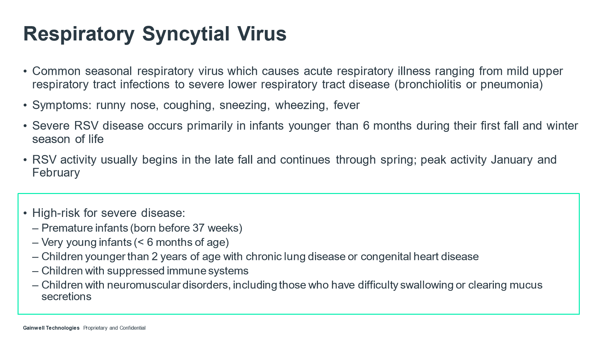

---
search:
  boost: 1
---

# Synagis Training

## Synagis Uptraining 9/27/23

[Synagis Uptraining Email](https://mygainwell-my.sharepoint.com/:u:/g/personal/christopher_nguyen_gainwelltechnologies_com/EZ42ZwzGB6hDk2xIv4AjoPYB9muLVgWDxCDtkFqEJSWsOg?e=WtUopG){ .md-button .md-button--primary target="_blank" rel="noopener"}

[Synagis Uptraining Video- 9/27/23](https://mygainwell-my.sharepoint.com.mcas.ms/personal/justin_collingwood_gainwelltechnologies_com/_layouts/15/stream.aspx?id=%2Fpersonal%2Fjustin%5Fcollingwood%5Fgainwelltechnologies%5Fcom%2FDocuments%2FRecordings%2FSynagis%20Uptraining%2D20230927%5F113424%2DMeeting%20Recording%2Emp4&nav=eyJyZWZlcnJhbEluZm8iOnsicmVmZXJyYWxBcHAiOiJTdHJlYW1XZWJBcHAiLCJyZWZlcnJhbFZpZXciOiJTaGFyZURpYWxvZyIsInJlZmVycmFsQXBwUGxhdGZvcm0iOiJXZWIiLCJyZWZlcnJhbE1vZGUiOiJ2aWV3In19&nav=eyJyZWZlcnJhbEluZm8iOnsicmVmZXJyYWxBcHAiOiJTdHJlYW1XZWJBcHAiLCJyZWZlcnJhbFZpZXciOiJTaGFyZURpYWxvZyIsInJlZmVycmFsQXBwUGxhdGZvcm0iOiJXZWIiLCJyZWZlcnJhbE1vZGUiOiJ2aWV3In19&referrer=Teams%2ETEAMS%2DELECTRON&referrerScenario=p2p%5Fns%2Dbim&ga=1){:target="_blank" rel="noopener"}

[Synagis Guidelines](https://mygainwell-my.sharepoint.com/:w:/g/personal/christopher_nguyen_gainwelltechnologies_com/ER8mq13wXIdAjMUOzYx7EnsBfPcfow6lC2w0M7ZjIXRlwg?e=TStFVO 9/27/23){:target="_blank" rel="noopener"}

## Entering Synagis PA 10/02/23

[Synagis Processing Guidelines and Epinephrine](https://mygainwell-my.sharepoint.com/:w:/g/personal/christopher_nguyen_gainwelltechnologies_com/EdF1lsQ6LblEtatAwy5lh9ABRGFth4Mix2_5D4m_w78jyQ?e=q4ofsm){:target="_blank" rel="noopener"}
- **Epinephrine Products:** We do not approve for epinephrine pro-actively, should be reviewed for approval after use of the product.

How to enter:

•	Dose: 15 mg/kg IM given monthly. First dose should be administered prior to the start of the RSV season and remaining doses administered monthly throughout the RSV season (typically November through April) 
•	Available in single-dose liquid solution vials: 50 mg per 0.5 mL and 100 mg per 1 mL
  

  o	If using Synagis 50 mg/0.5 ml: Enter by GCNSEQNO and DDU is MLS per 28 days. 
  o	If using Synagis 100 mg/ml: Enter by GCNSEQNO and DDU is MLS per 28 days. 
  o	If using HICL: Enter by HICL Seqno: 018564 and DDU as MLS per 28 days.  
  o	Approval length: starting on 11/01/2023 through 3/31/2023.

**PA comes in on 10/1 and criteria meets approval** → Approval starting on 11/01-5 doses through 3/31/23.

**PA comes in on 12/1 and criteria meets approval** → 4 doses through 3/31/23.

•	**Epinephrine Products**: We do not approve for epinephrine pro-actively, should be reviewed for approval after use of the product.

See Denial Language document for current denial language.

### 9/22/22 (ARCHIVE)

[Synagis Powerpoint](https://mygainwell-my.sharepoint.com/:p:/r/personal/christopher_nguyen_gainwelltechnologies_com/Documents/Evergreen/Emails/Synagis%20training.pptx?d=w757935c4a8da4d4280a665b8f13e02e8&csf=1&web=1&e=5kuPuL){ .md-button .md-button--primary target="_blank" rel="noopener"}

~~[Video of Training](https://mygainwell-my.sharepoint.com/:v:/r/personal/cassandra_roach_gainwelltechnologies_com/Documents/Recordings/Synagis%20(2022-2023)%20Training%20with%20Debbie%20Brokaw-20220914_140123-Meeting%20Recording.mp4?csf=1&web=1&e=VD1LZN)~~

