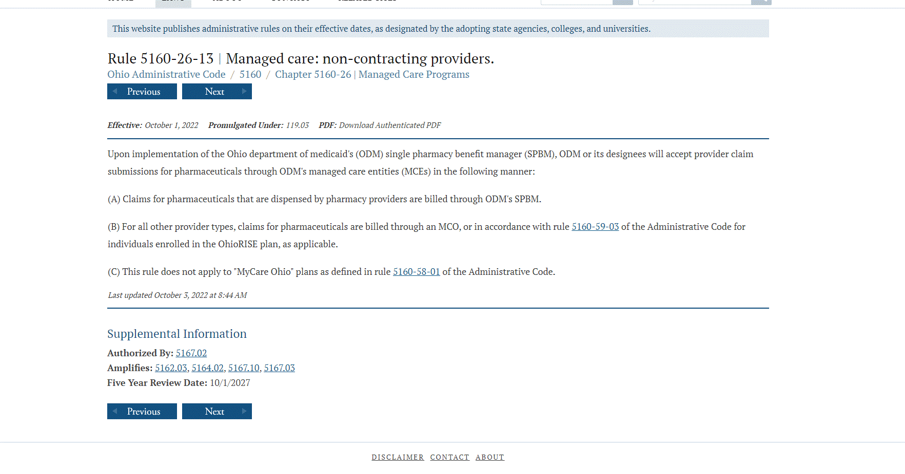
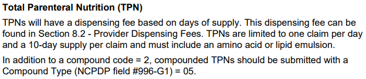

---
search:
  boost: 1
---

# TPN and all medications dispensed for provider 70

Hello, 

There have been some recent questions associated with TPN billing/prior authorizations.

This Email is to stress the importance in verifying all meds, TPN or otherwise, that when being dispensed from a 70 provider pharmacy, are paid for through the SPBM and information found in OAC and SPBM handbook

and

Any questions regarding the billing and processing the prior authorizations of this type of medication please contact your leads

Thanks,
 
Justin Collingwood

[TPN and all medications dispensed for provider 70 :material-email:](<TPN and all medications dispensed for provider 70.htm>){ .md-button .md-button--primary target="_blank" rel="noopener"}

