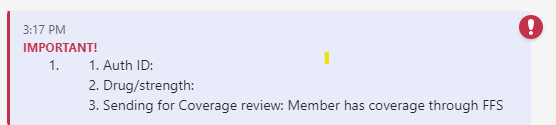
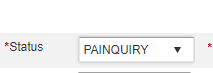

# Verify Coverage

[Verify Coverage Email :material-email:](https://mygainwell-my.sharepoint.com/:u:/r/personal/christopher_nguyen_gainwelltechnologies_com/Documents/Evergreen/Emails/_encrypt_Verifying%20Coverage%20in%20Member%20Tile%20Vue360RX%20_____New%20Process____.msg?csf=1&web=1&e=nwd4de){ .md-button .md-button--primary }

If we identify a member does not have coverage (for example: member has FFS or No Active Coverage), this will need to be verified through the MITS system. (Medicaid Information Technology System). 

1. Do not CANCEL the Prior Authorization 
2. Please document in your notes 
    - Auth ID: 
    - Drug/strength:   
    - Sending for Coverage review: Member has coverage through FFS

- Send to the Additional Info Needed Chat using the template and mark the comment as **IMPORTANT** 
    - Auth ID: 
    -Drug/strength:   
    - Sending for Coverage review: Member has coverage through FFS 

1. Place the Prior Authorization in the **PAINQUIRY** queue by changing the Status to PAINQUIRY 

1. If the Technician verifies the member has coverage, they will copy & paste the message to the RPH Consult Chat (Rph will angry face to claim) and we will need to decision the Prior Authorization (please retrieve the PA from the PAINQUIRY queue). Document using the Approved and Denied Templates.

1. If the Technician verifies the member does not have coverage, the technician will CANCEL and send the appropriate fax back. 
