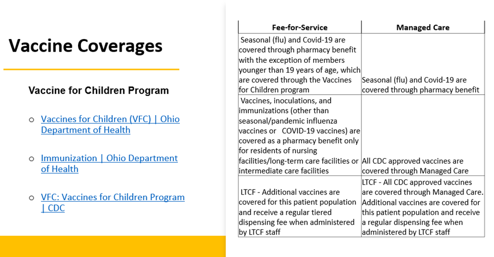

# Fee for Service (rph)

[FFS PowerPoint](https://mygainwell-my.sharepoint.com.mcas.ms/:p:/g/personal/brittaney_thompson_gainwelltechnologies_com/ERr2UzISez9HkHderUnQiHgBxN0uQurZeEy8AJFSVQcqxg?e=FOgR5o){:target="_blank" rel="noopener"}

## Two different Pharmacy Reference Guides

[Fee for Service Pharmacy Reference Guide](https://spbm.medicaid.ohio.gov/SPDocumentLibrary/DocumentLibrary/User%20Guides/Gainwell%20OHSPBM%20FFS%20Pharmacy%20Reference%20Guide%20v1.0_07.2023.pdf){:target="_blank" rel="noopener"}

[Managed Care Pharmacy Reference Guide](https://spbm.medicaid.ohio.gov/SPDocumentLibrary/DocumentLibrary/User%20Guides/SPBM%20Pharmacy%20Reference%20Guide.pdf){:target="_blank" rel="noopener"}

### Quick Review

**IMPORTANT**  FFS BIN/PCN are changing from the former CHC BIN: 015863 and PCN: OHPOP to BIN: 024251 and PCN: OHRXPFFS – ***Pharmacies may be confused by this.  Just explain they need to bill the new BIN/PCN for their FFS Medicaid consumers.***

 

 

 

 

 

 

 

 

 

 

 

 

