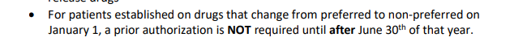

# Attention Deficit Hyperactivity Disorder Agents

## Aprovals language due transition of care/COT

Hello,
In the effort to make as simple as possible the possible approval language to use for adhd through 6/30/23 approvals, ^^please use the following template:^^

***Per UPDL additional information, this medication is (step therapy/ not preferred) but will be approved through 6/30/23. For renewal the following criteria needs to be met : (add denial language for whatever drug is being approved for)***

If choosing to use this, please select the appropriate denial language from the denial language sheet, and only select step therapy or not preferred depending on status.
Thanks,

Justin Collingwood
