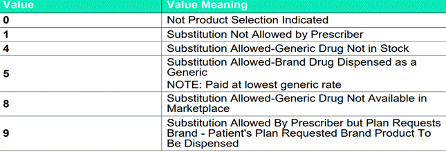

---
search:
  boost: 1
---

# Adderall XR Shortage

 ***5/12/23***
 

Good morning!

@OH Supervisors and Sr. Techs – please forward communication to your teams.

Please see communication below surrounding requests for brand name Adderall due to generic shortage. At this time, brand name will not hit for PA required, but will still hit for DAW 4 (Edit 7282) and 8 (Edit 7515) which may result in calls in to the call center. We can enter these overrides in and approve x 90 days if we receive a call for brand name requested.

^^Call center direction (calls received for brand name due to generic shortage)^^:

1. Please place edit override approval x 90 days for DAW 4 (Edit 7282) and/or 8 (Edit 7515) depending on how the claim is rejecting.

2. Have the pharmacy reprocess to get a paid claim.

^^PA operations direction (PA’s received for brand name due to generic shortage)^^:

1. Look at PA and rejected claims to see if request is for brand name due to generic shortage (will reject for 7282 or 7515).

2. If rejecting for 7282 or 7515, please enter the appropriate ***edit override*** (7282 or 7515) and approve x 90 days. Please note internally on the EO that you are placing approval due to generic shortage.

3. Since you have placed the edit override to allow the claim to pay, you can select “Not required” for the PA and note ^^internally^^ that you have placed the appropriate EO to allow the brand name to pay for the member.

4. If the request is for a DAW1 situation (7235), please send to MEDREVIEW for pharmacist to determine if it is a true DAW1 request. If a true DAW1 request, the pharmacist will review against the medical necessity policy.

Any questions, please don’t hesitate to reach out.

Thank you,

Cassandra Roach, PharmD, RPh

### ARCHIVED

[Guidance for Brand request for Adderall XR Email :material-email:](https://mygainwell-my.sharepoint.com/:u:/r/personal/christopher_nguyen_gainwelltechnologies_com/Documents/Evergreen/Emails/Guidance%20for%20Brand%20request%20for%20Adderall%20XR.msg?csf=1&web=1&e=kZJPle){ .md-button .md-button--primary target="_blank" rel="noopener"}

Guidance for Brand request for Adderall XR
 
- Per clinical guidance, we want to allow patients to stay on the same product.
- Per the ASHP website, Amphetamine Mixed Salts, Extended-Release Capsules is on nationwide shortage. 
- Call received from the pharmacy:
 
	- If a call is received from the pharmacy, have the pharmacy run the claim for Brand name Adderall with a DAW 4 and/or DAW 8 if the Brand is being requested due to generic shortage.
	- If still receiving a rejection, place an EO for 3 months (some manufacturers may have generic in stock by the end of February 2023).
	- Please document in the EO that this is being approved due to the generic shortage.
 

 
- If a PA request is received for Adderall Brand (DAW1)
 
- Request must indicate Brand is requested due to the generic medication shortage
	- Please document in your notes
	- Approve for short term of 3 months			
	- Add the EO for short term of 3 months (Edit 7235 - DAW Code 1– for Non-Compound Drug)
	 
- If request does not indicate Brand is requested due to the generic medication shortage
	- Review according to DAW policy
