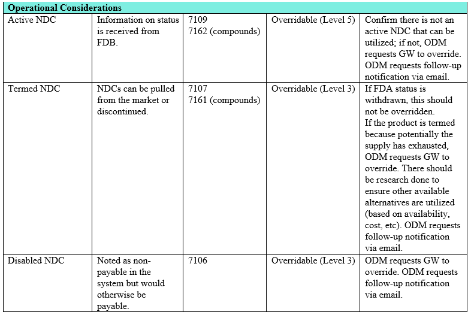
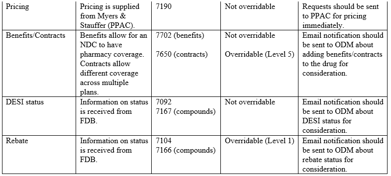

---
search:
  boost: 1
---

# EPSDT Procedures

Hello,

After gathering more descriptive information and finalizing the process, the following information can be used in decisioning prior authorizations for EPSDT.
 
Before admin denying anything based on rebate or payable, double check the age to make sure member is 21 or over.

If 21 or over please admin deny

***If less than 21, rebate or payable (red X situations in NDC tile), we are to proceed as usual with decisioning disregarding this status.***
 
We are to ensure it is the lowest cost alternative that effectively addresses and treats the medical problem, meaning if there are UPDL alternatives that are indicated to treat the condition, we still use the hierarchy of payable, UPDL(preferred, step, nonpreferred) – Additional Criteria Classes – then refer to Med Nec Policy.

We are also to ensure it meets generally accepted standards of medical practice; it is clinically appropriate in its type, frequency, extent, duration, and delivery setting; and it is appropriate to the adverse health condition for which it is provided and is expected to produce the desired outcome. This means we are to access if FDA approved, indicated for the diagnosis, dosing and time expected to use are indicated, and how given is appropriate per information we have, similar to Med Nec for payable products.
 
If we receive a PA for one of these non-payable cases for a member under the age of 21 that is appropriate to approve, the procedure is as follows:

==SEE EPSDT EO section below when considering approvals==

1. Use the approval template and include verbiage in internal notes – ***Approving per medical necessity for EPSDT member***
2. ~~Approve the PA for standard amount of time for treatment, if chronic condition 365 days is acceptable~~ 
3. ~~Enter in the Edit Override for the necessary edits that are firing in these situations, I forsee 7106 and 7104 being used mostly, if there is an edit that needs to be overridden in these cases that we are not able to select please contact Rachel Carpenter, Cassandra Roach, or I, and we will try to find the best way for the member to get their medication (I don’t have solid figures but I do not believe this should happen often)~~
 
~~As far as entering in these Edits, they must be done only when a PA is put in place and approved, and only after a pharmacist has reviewed it for medical necessity if applicable (may still require the peer to peer or appeals process, but not for payable status)~~

**Technicians should never be entering in these edits**

We (the pharmacists) have been given access to these edits in the purpose that if we are able to easily apply this to this situation to assure members can get the medication they need, we may do it when it applies.
 
Some situations to be aware of:

If it is rejecting for 7371D : Bill as Medical Supply, this product is more than likely to be covered under the medical portion and should be requested under the MCE medical coverage, they can be cancelled and sent in the ADDITIONAL INFO. CHAT FOR PHARMACISTS.
Pharmacy dispensing must still be a 70 pharmacy as in payable products.
 
Questions that were asked answered:

- Does EPSDT then cover the usual non-covered diagnosis(obesity, erectile, dysfunction)
    - Yes, as long as follows medical necessity.

- What happens if a member is 20 and turning 21
    - consider short dating the PA to the time of when member is 21, EPSDT does not apply then. It may be appropriate to send information in approval text to explain the situation.

- If a medication has a similar diagnosis and a payable counterpart, should we use the payable one (Wegovy vs Ozepmic)
    - We would rather use the payable option, and further clarification may be needed from the prescriber with a call or fax back requesting this information.
 
Please ask any questions if necessary,

Thanks,
 
Justin Collingwood

## EPSDT Edits 7/19/23

When considering approval, these edit rejections do not require a preliminary email before approving to clinical to send to ODM.

==So for our processes, if approving we approve, then we enter the EO, and then send the email to ~~Casandra~~, Justin, Sherri, Brian to inform ODM== [Weekly Email 7/29/23]([weeklyemail72923.docx](https://mygainwell-my.sharepoint.com/:w:/g/personal/christopher_nguyen_gainwelltechnologies_com/EX294TODOapHr_QzAWmTNDUB6dFP3jbMimTXSl_48KOt4A?e=ANycRR)){:target="_blank" rel="noopener"}

The following edits when tripped MUST ask ODM first, as in if we are considering approving we send the following template information to clinical to send to email ODM prior to approval.

==For our processes, we MUST send the email in template form to leaders and ODM approval BEFORE approving for EPSDT.== Please send to ~~Cassandra,~~ Brian M, Justin, Sherri for correspondence to ODM. (no clinical involved) [Weekly Email 7/29/23]([weeklyemail72923.docx](https://mygainwell-my.sharepoint.com/:w:/g/personal/christopher_nguyen_gainwelltechnologies_com/EX294TODOapHr_QzAWmTNDUB6dFP3jbMimTXSl_48KOt4A?e=ANycRR)){:target="_blank" rel="noopener"}

***Quick Email link:*** <a href="mailto:justin.collingwood@gainwelltechnologies.com;sherri.cohmer@gainwelltechnologies.com;brian.moore@gainwelltechnologies.com?subject=EPSDT EO&body=PA%20number:%0D%0A%0D%0AEdit%20number%20to%20override:%0D%0A%0D%0AApproval%20rationale:">  Justin; Brian; Sherri</a>

^^Template to clinical^^

PA number:

Edit number to override:

Approval rationale:

There will be times when we are working when ODM or clinical ^^won’t be able to respond within TAT for PAs(the weekend, overnight).^^ In this situations if it is feasible that we will not get a response, Please send the email questioning first as described above, and deny the PA with the **denial language**:

PLEASE NOTE THIS IS NOT A DENIAL - further research and outreach is required (that may include but is not limited to: benefits, DESI status, rebate status, etc.) This will be decided within 72 hours of prior authorization received.

When and if it is approved clinical/ODM will contact the group that are able to enter the EO, and the pharmacist that processed originally will complete an approved PA, and the group (Cassandra, Justin, Brian, etc.) will enter the edit override portion of the approval.

Thanks,
Justin Collingwood

## Medications not EPSDT eligible

• [Deplin](https://special-spoon-f542dccd.pages.github.io/Pharmacist%20Reference%20Guide/Medication%20Guidance/medicalfood/)

### References

[EPSDT Procedures Email :material-email:](EPSDT Procedures.htm){ .md-button .md-button--primary target="_blank" rel="noopener"}

[EPSDT Background Email :material-email:](In preparation of the EPSDT portion of todays RPh Updates.htm){ .md-button .md-button--primary target="_blank" rel="noopener"}
