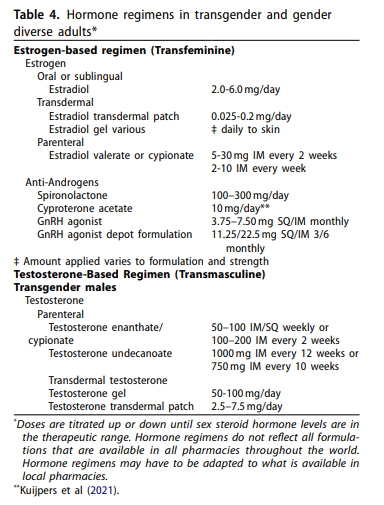
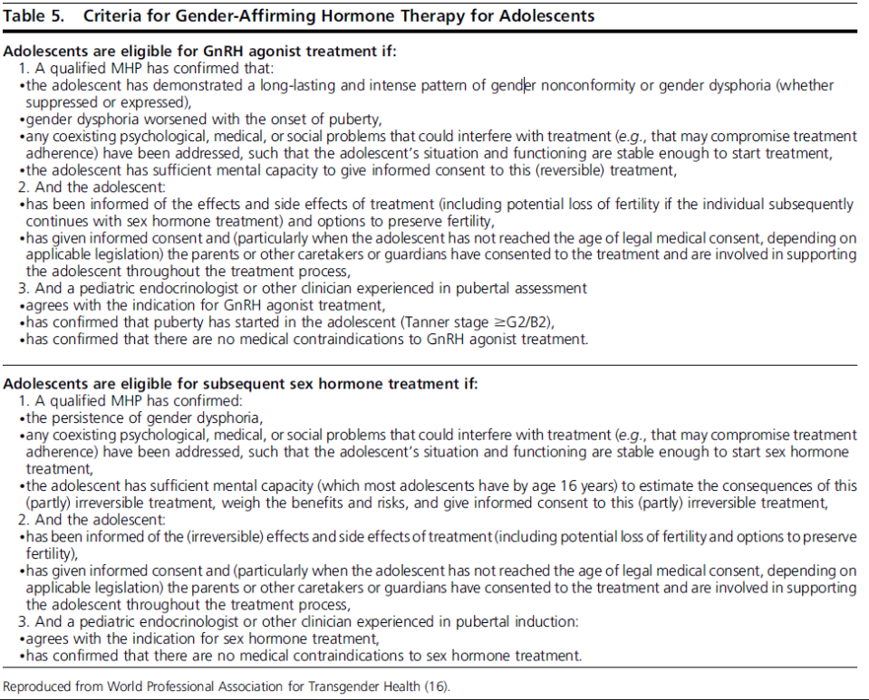

---
search:
  boost: 1
---

# Gender Dysphoria

[Medical Necessity Policy](<../../UPDL and Supporting Documents/medical_necessity_policy.md>)

[Medical Necessity Policy Official PDF](https://mygainwell-my.sharepoint.com.mcas.ms/personal/christopher_nguyen_gainwelltechnologies_com/_layouts/15/onedrive.aspx?id=%2Fpersonal%2Fchristopher%5Fnguyen%5Fgainwelltechnologies%5Fcom%2FDocuments%2FEvergreen%2FEmails%2FMedical%20Necessity%5FOH%20SPBM%5FPolicy%5FV3%2E0%2Epdf&parent=%2Fpersonal%2Fchristopher%5Fnguyen%5Fgainwelltechnologies%5Fcom%2FDocuments%2FEvergreen%2FEmails){:target="_blank" rel="noopener"}

***Gender Dysphoria***

If the member is less than 21 years of age, the request will be reviewed under Medical Necessity based 
on the EPSDT section noted above. 

If the member is 21 years of age or older, the request will be reviewed using the following:

^^Initial Criteria^^

1. The drug is FDA (Food and Drug Administration) approved; and

2. The prescription drug is recognized for treatment of the indication in one of the following:

    a. World Professional Association for Transgender Health (WPATH)

    b. Endocrine Treatment of Gender-Dysphoric/Gender-Incongruent Persons: An Endocrine 
Society Clinical Practice Guideline

    c. Evidence from at least two published studies from major scientific or medical peer 
reviewed journals demonstrates safety and efficacy for the specified condition in a 
comparable population (e.g., age group, level of disease severity, etc.)

        i. If applicable clinical trial is yet to be published but interim results are supportive, 
this may be taken into consideration by the clinician reviewer.

^^Renewal Criteria^^

1. Documentation has been provided showing that member’s clinical response to treatment and 
ongoing safety monitoring

## World Professional Association for Transgender Health

[WPATH Standard of Care Guidelines](https://www.tandfonline.com/doi/pdf/10.1080/26895269.2022.2100644){:target="_blank" rel="noopener"}

WPATH and the other Endocrine Guidelines recommend in order for adolescents to get GnRH: 
 

## Preferred vs Nonpreferred Evaluation 8/26/23

[Weekly Email 8/26/23](https://mygainwell-my.sharepoint.com/:w:/g/personal/christopher_nguyen_gainwelltechnologies_com/EYnhUkLLPZVNt_4Yjl3mhZcBWApd5ZTU7TyrmNfHNgsyIQ?e=k57DKt){:target="_blank" rel="noopener"}

•	As stated in the Med Nec Policy, when using medications for Gender Dysphoria ***preferred and non-preferred status doesn’t matter***, just what are in the resources provided. (Basically, all meds are considered preferred as long as its on WPATH)

### Additional Clinical References

[https://www.ncbi.nlm.nih.gov/pmc/articles/PMC8907681/](https://www.ncbi.nlm.nih.gov/pmc/articles/PMC8907681/){ :target="_blank" rel="noopener"}

[https://www.mayoclinic.org/diseases-conditions/gender-dysphoria/diagnosis-treatment/drc-20475262](https://www.mayoclinic.org/diseases-conditions/gender-dysphoria/diagnosis-treatment/drc-20475262){ :target="_blank" rel="noopener"}

[Gender Affirming Treatment](https://mygainwell-my.sharepoint.com/:b:/r/personal/christopher_nguyen_gainwelltechnologies_com/Documents/Evergreen/Emails/Gender-Affirming%20Therapy.pdf?csf=1&web=1&e=P5UIWV){ :target="_blank" rel="noopener"}

[Transgender Medicine](https://mygainwell-my.sharepoint.com/:b:/r/personal/christopher_nguyen_gainwelltechnologies_com/Documents/Evergreen/Emails/AACE%20Transgender%20Health%20Slide%20Set%20v3.pdf?csf=1&web=1&e=6neFS5){ :target="_blank" rel="noopener"}

[Hormonal Therapy for Gender Dysmorphia](https://www.sfdph.org/dph/files/THS/HormoneTxAllinOne.pdf){:target="_blank" rel="noopener"}

