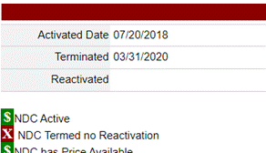
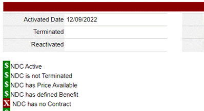
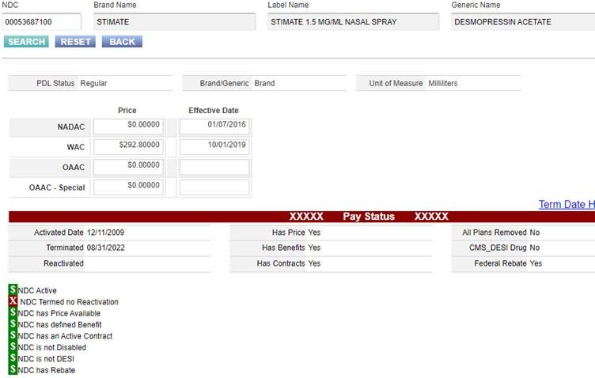

---
search:
  boost: 1
---

# Non-Payable NDCs

## Azelex

There are issues with no payable NDCs for preferred Azelex at this time.

From direction of ODM, we are to not allow the non-rebateable labelers that NDCs start with 16110

We are to allow the labeler 00023 if the pharmacy is dispensing a non-expired product from that manufacturer.

If we get questions regarding this medication at this time this is what must happen.
Currently the rejection is 7107 that we will see. The procedure for this will be as follows:

1. If a pharmacy calls in for a claim of Azelex, check claims to see NDC being processed 

- If NDC starts with 00023, verify the lot and expiration date on the product, and document lot and expiration date information in EO notes, and override 7107 

- If NDC starts with 16110, inform the pharmacy that the only payable option at this time is the product by labeler Abbvie, NDC starting with 00023and does require a call in to provide information for a claim to be processed. 
 
This is a process that does not require a pharmacist, so technicians are able to do it, but the correct information must be documented when calling in for an override. The availability for the ones we do accept may be scant to none, but this is the directive we have been given.
 
Any questions please ask,

Thanks,

Justin

## Imcivree

To this point, ODM has only been honoring previous Prior Authorizations granted by the MCOs. They are not approving new coverage requests because drugs use for treatment of obesity are excluded per [OAC 5160-9-03](https://codes.ohio.gov/ohio-administrative-code/rule-5160-9-03){:target="_blank" rel="noopener"}.
 
On a slight side note, there are some discussions about notifying or “escalating” decisions on certain drugs to ODM so they are aware. I will recommend this be considered for that list.
 
Thanks,
 
Jason Foote, PharmD, MSHI

Clinical Pharmacist

OH Medicaid PBM

## Jatenzo 237mg

FYI, not covered by ODM.

## Relexxi- other than 72

Hi Prachi,  

So looking at the other 2 strengths, 72mg is the only one payable.  Either the other strengths are no longer available in the FDB file,  

OR.....currently has no contract...

The actual contracts are added through health pas administrator, not VUE360.  So in this case here, they haven’t added the particular contract.  From what I understand that is a conversation between the state and Change HC, the PDL vendor. 

Currently though, what you said below is correct, only the 72mg is the only one payable. 

Let me know if you need further clarification….thank you, Scott  

## Stimate

Hi Prachi, unfortunately if the NDC is “Termed, no Re-activation”, the prescriber will have to find an alternative. 

Thank you, Scott 

From: Patel, Prachi <prachi.patel@gainwelltechnologies.com>  

Sent: Friday, January 6, 2023 11:19 AM 

To: OH_MCD_PBM_clinical <OH_MCD_PBM_clinical@gainwelltechnologies.com> 

Subject: Non-payable NDC 

Hello, 

I received a prior auth recently for Stimate nasal spray for Von Willebrand Disease, which is listed on the OH Additional Therapeutic Classes Policy.  Currently there is only one NDC (brand) available and is non-payable in Vue360Rx. I’m wondering if it is payable on a case by case basis, or if the drug needs to be changed to payable status.  The PA request for the Stimate was not approved due to lack of clinical info, but just want to clarify in case the prescriber requests again with the required pertinent information. Thank you. 

## Boutique Labelers

Hi PA Team, 

On Friday April 28th, ODM asked us to manually disable 6 manufacturers (71800, 59088, 82379, 69067, 71741, 50991) along with two other NDCs (15370018060, 70512001315). If we receive any requests for these products, please do not override at this time. Please point to our preferred OTC products. Please send an email to Clinical Inbox OH_MCD_PBM_clinical@gainwelltechnologies.com for ODM follow-up. 

Thank you, 

Lauren Sarahman, PharmD 
 
Clinical Pharmacist

- ***NDC***: 15370-0180-60 : ***LOFENA 25 MG TABLET*** | DICLOFENAC POTASSIUM
- ***NDC***: 70512-0013-15 : ***LENZAPRO FLEX 4%-4% PATCH*** | LIDOCAINE HCL/MENTHOL 
- ***Manufacturers:***
    - 71800 
    - 59088
    - 82379
    - 69067
    - 71741
    - 50991

