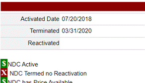
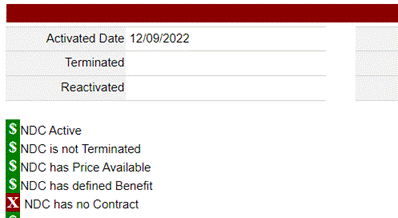

# Relexxi- other than 72

[Relexxi Email :material-email:](https://mygainwell-my.sharepoint.com/:u:/r/personal/christopher_nguyen_gainwelltechnologies_com/Documents/Evergreen/Emails/RE_%20Non-payable%20Relexxii%20.msg?csf=1&web=1&e=ts8a3U){ .md-button .md-button--primary target="_blank" rel="noopener"}

Hi Prachi,  

So looking at the other 2 strengths, 72mg is the only one payable.  Either the other strengths are no longer available in the FDB file,  

OR.....currently has no contract...

The actual contracts are added through health pas administrator, not VUE360.  So in this case here, they haven’t added the particular contract.  From what I understand that is a conversation between the state and Change HC, the PDL vendor. 

Currently though, what you said below is correct, only the 72mg is the only one payable. 

Let me know if you need further clarification….thank you, Scott       