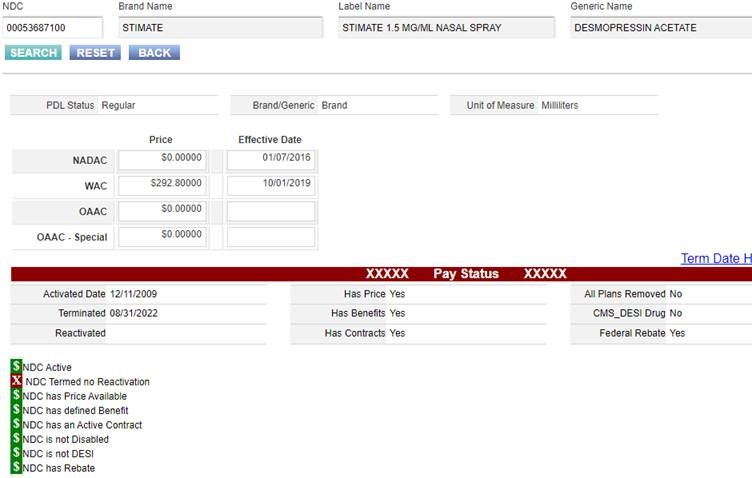

---
search:
  boost: 1
---

# Stimate

[Stimate Email :material-email:](https://mygainwell-my.sharepoint.com/:u:/r/personal/christopher_nguyen_gainwelltechnologies_com/Documents/Evergreen/Emails/FW_%20Non-payable%20NDC%20-%20Stimate.msg?csf=1&web=1&e=ONdk3F){ .md-button .md-button--primary target="_blank" rel="noopener"}

Hi Prachi, unfortunately if the NDC is “Termed, no Re-activation”, the prescriber will have to find an alternative. 

Thank you, Scott 

From: Patel, Prachi <prachi.patel@gainwelltechnologies.com>  

Sent: Friday, January 6, 2023 11:19 AM 

To: OH_MCD_PBM_clinical <OH_MCD_PBM_clinical@gainwelltechnologies.com> 

Subject: Non-payable NDC 

Hello, 

I received a prior auth recently for Stimate nasal spray for Von Willebrand Disease, which is listed on the OH Additional Therapeutic Classes Policy.  Currently there is only one NDC (brand) available and is non-payable in Vue360Rx. I’m wondering if it is payable on a case by case basis, or if the drug needs to be changed to payable status.  The PA request for the Stimate was not approved due to lack of clinical info, but just want to clarify in case the prescriber requests again with the required pertinent information. Thank you. 

