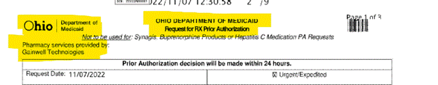
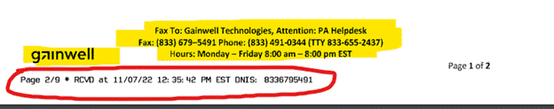

---
search:
  boost: 1
---

# Acceptable PA Forms

Hi Team, 

The following guidance has been updated in the Technician Reference Guide in Evergreen. Please disseminate to your teams. 

When we receive a PA on the wrong PA form - 
o	We should be decisioning per criteria and NOT cancelling due to wrong PA form until further notice 
o	Example - Caresource PA form, old ODM PA forms,  Opioid on standard PA form --- Review all PAs as if the form was correct 

~~We have received new guidance regarding PA’s sent in on incorrect PA forms from management. As of 11/1/22, we have been given permission to reject PA’s that are not on correct forms specific to Gainwell. I have attached a picture of one of our forms for your reference. A complete list of the Gainwell PA forms can be found on the portal [https://spbm.medicaid.ohio.gov/SPContent/DocumentLibrary/Forms](https://spbm.medicaid.ohio.gov/SPContent/DocumentLibrary/Forms). There are several different types of forms, so please familiarize yourself with what they look like.~~ 

 
~~The system will filter PA’s at the fax queue level and incorrect forms will reject prior to us evening seeing them in PENDING or MEDREVIEW queues; however, we currently have a backlog of PA’s in PENDING that have come through that may be on an incorrect form.~~
 
~~What does this mean for you? What are the next steps?~~

~~1. When pulling up a PA from PENDING or MEDREVIEW, after checking member name, eligibility, drug, etc. look at the PA form and verify that it is indeed a Gainwell PA form. These are the identifiers you will look for:~~
	
~~**Top** of page will look like this~~

	 
~~**Bottom** of page will look like this~~

	
	 
~~**Double check that the received date is on or after 11/1/22**~~
	 
~~2. If the PA is on a Gainwell PA form, proceed with processing the PA as normal.~~

~~3. If the PA is on any other form, please use the following steps:~~

- ~~Cancel (DO NOT DENY) your case with the following note template:~~
		
~~The Prior Authorization request was sent in using the wrong form. Provider must utilize the Gainwell {Name of Form Ex: Synagis Prior authorization form} and resubmit. Sending provider fax back.~~
			
- ~~In the **“Additional Info Needed by Tech”** chat, please use the following template:~~
					
~~Auth ID cancelled:  XXXX~~

~~Drug/strength:  XXXX  XXmg~~
					
~~Reason for fax:  The Prior Authorization request for {Member Name, DOB, Medicaid ID#, and Drug Name} was sent in using the wrong form. Please utilize the Gainwell {Name of Form} and resubmit.~~

~~I have added technician management to the email so they are aware of this process and can disperse to technicians as appropriate.~~
 
~~Please let me know if you have any additional questions,~~
 
Cassandra Roach, PharmD, RPh

