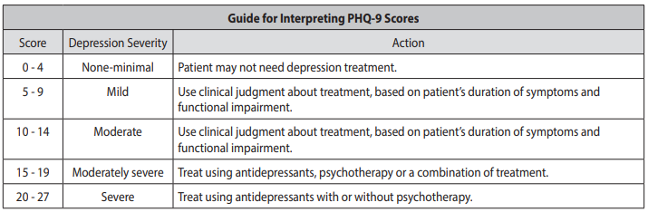
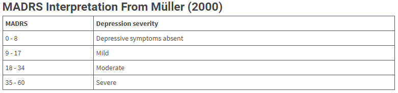
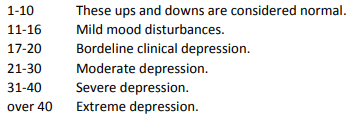
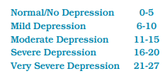
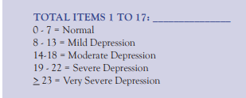

---
search:
  boost: 1
---

# Depression Assessment Scales

## Patient Health Questionnaire (PHQ-9)

[Patient Health Questionnaire (PHQ-9)](https://www2.gov.bc.ca/assets/gov/health/practitioner-pro/bc-guidelines/depression_patient_health_questionnaire.pdf){:target="_blank" rel="noopener"}

## Montgomery-Åsberg Depression Rating Scale (MADRS)

[Montgomery-Åsberg Depression Rating Scale (MADRS)](https://www.mdapp.co/montgomery-asberg-depression-rating-scale-madrs-score-calculator-497/){:target="_blank" rel="noopener"}

## Beck Depression Inventory (BDI)

[Beck Depression Inventory (BDI)](https://www.ohsu.edu/sites/default/files/2019-06/Beck%20Depression%20Inventory.pdf){:target="_blank" rel="noopener"}

## Quick Inventory of Depressive Symptomatology (QIDS)

[Quick Inventory of Depressive Symptomatology (QIDS)](https://alnursing.org/wp-content/uploads/2020/03/Depression-Questionnaire-QIDS-SR-16.pdf){:target="_blank" rel="noopener"}

## Hamilton Rating Scale for Depression (HAM-D)

[Hamilton Rating Scale for Depression (HAM-D)](http://www.assessmentpsychology.com/HAM-D.pdf){:target="_blank" rel="noopener"}

