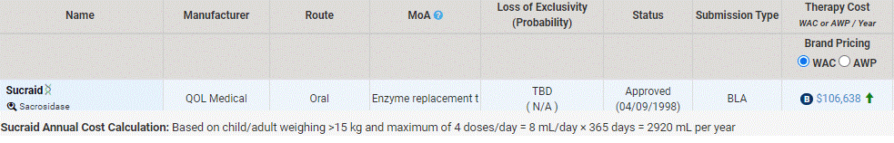

---
search:
  boost: 1
---

# Sucraid

[Sucraid Email :material-email:](https://mygainwell-my.sharepoint.com/:u:/r/personal/christopher_nguyen_gainwelltechnologies_com/Documents/Evergreen/Emails/Medication%20Guidance-%20Sucraid.msg?csf=1&web=1&e=n5tkyT){ .md-button .md-button--primary target="_blank" rel="noopener"}

Please review the information provided below and use for guidance.

**Suggested Medication Guidance:**

- Diagnosis of Congenital sucrase-isomaltase deficiency
- Must be 5 months of age or older
- Diagnosis by:
	- Small bowel biopsy showing low sucrose activity and normal amounts of other disaccharides **OR** 
		- Meeting all of the following criteria: 
			- Stool pH< 6 
			- Increase in breath hydrogen of >10ppm when challenged with sucrose after fasting 
			- Negative lactose breath test
- Prescribed by a pediatric gastroenterologist or genetic specialist
- Dose is within the FDA approved labeling
 
- Please see the attached for the Sucraid Package Insert and the below information from IPD analytics for information on Sucraid.

 
***Use: Labeled Indications***

***Congenital sucrase-isomaltase deficiency:*** Oral replacement therapy in sucrase deficiency, as seen in congenital sucrase-isomaltase deficiency (CSID).
 
Congenital sucrase-isomaltase deficiency (CSID) is a rare, inherited metabolic disorder characterized by the deficiency or absence of the enzymes sucrase and isomaltase. This condition reduces the ability of the patient to digest foods that contain sugars or starches. The enzyme, sucrase-isomaltase, can be completely absent or in very low levels of activity.

When the sucrase and isomaltase enzymes have low or nonexistent activity, it can cause many gastrointestinal (GI) symptoms, including diarrhea, gas, bloating, and abdominal pain. The symptoms of CSID typically manifest in late infancy or early childhood. Onset of symptoms is directly related to food consumption of the child. In exclusively breast-fed babies, symptoms may not begin until sucrose-containing foods are introduced into the diet. Some patients may experience more mild symptoms, which can lead to the condition not being diagnosed until adulthood. In addition, given the nonspecific symptoms of CSID, the condition is often misdiagnosed as other functional GI disorders, and CSID diagnosis is not confirmed until later on in the course of the disease. Once CSID begins to be suspected, diagnosis can be made through several mechanisms, including intestinal biopsy, carbon-13 (C13) breath test, or through genetic testing.

A complicating factor in diagnosis is deciphering between congenital sucrase-isomaltase deficiency and acquired/secondary sucrase-isomaltase deficiency (SID). Acquired SID can result from gastrointestinal disorders, such as celiac disease, Crohn's disease, or even acute gastroenteritis. The symptoms of SID should resolve once the underlying etiology is addressed. Currently, most diagnostic modalities cannot decipher between the acquired and congenital forms, which presents a complicating factor to health plans when approaching Sucraid approval. Sucraid is indicated in the treatment of CSID specifically, and efficacy has not been established in the acquired SID form.
 
***Is there a gold standard for diagnosis that is able to decipher between the congenital and acquired forms of sucrase-isomaltase deficiency (SID)?***

- There does not currently exist an accessible, standard diagnostic test that is able to decipher between the two forms. This presents a difficulty to payers, as this distinction is important in issuing approval for Sucraid. Sucraid is a treatment specifically for CSID. Since acquired SID occurs as a result of an underlying pathology (e.g. celiac disease), patients are not often treated for SID, but rather treatment of the underlying etiology is targeted with the hope that it will cause resolution of SID.
- To our knowledge, there is only one approach to truly decipher between the acquired and congenital forms, and that is through sequencing the entire SI gene. Conducting this is not commonplace in practice and is also not an accessible option to all patients. In addition, to sequence an entire gene is expensive, and may not be a necessary or cost-effective approach to ensuring accurate diagnosis.

    - CSID is caused by a mutation in the SI gene on chromosome 3. CSID is an autosomal-recessive condition; however, there are some heterozygotes that will experience symptoms, albeit less severe. In North America, there appear to be four common mutations that account for the majority of CSID cases. A study found that there is an 83% probability that an individual of European descent with CSID will have one of these four mutations.
    - When approaching genetic testing, is important to distinguish whether the test sequences the entire SI gene or whether it is just a panel of the four common mutations. If it is the latter, there is a possibility that a true CSID patient will not be identified. The price discrepancy between these two are quite significant, with one source stating the entire SI sequence costs approximately $8,000 and the panel of the four common mutations costs around $1,000.
      
        - The cost, availability, and accuracy of the genetic tests may impact payer decisions to require this as a diagnostic criterion. It does appear as though the gold standard for CSID diagnosis remains the small intestinal biopsy, even though it is unable to decipher between the types. If a request is sent to the plan for Sucraid when the patient has already had genetic testing conducted and CSID diagnosis ascertained, it would appear appropriate to accept this as an accurate means of diagnosis. But requiring such testing has many factors to consider, mentioned above. 
        - It would appear reasonable to defer to the clinical judgment of the treating physician in regard to whether the SID is congenital or acquired. A criterion to implement may be to require this specification through attestation in the documentation for approval.
 

**Management Opportunities and Strategies**

- Most large payers do have criteria in place for Sucraid.
- The most common criterion is a diagnosis of CSID, with some payers specifically calling out secondary/acquired SID as a condition for which Sucraid is not covered.
- Other common criteria involve the confirmation of SID diagnosis through intestinal biopsy, C13 breath test, or meeting other specified criteria from the Sucraid package insert (stool pH <6, an increase in breath hydrogen >10 ppm when challenged with sucrose after fasting, and a negative lactose breath test).
 
References:
ipdanalytics.com 
https://www.sucraid.com/

Lexi