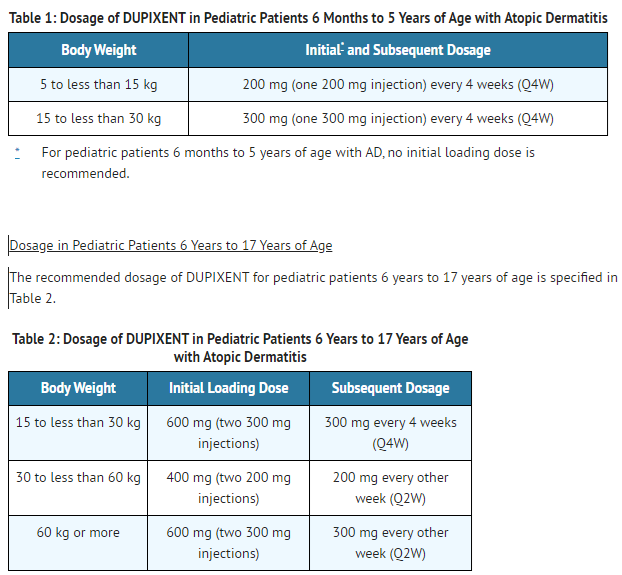

---
search:
  boost: 1
---

# Immunomodulators for Systemic Inflammatory Disease DLP

[9/15/23- Must use Decision Pathway for Humira](https://special-spoon-f542dccd.pages.github.io/Pharmacist%20Reference%20Guide/Decision%20Pathways/Humira/)

## 11/6/23

[Weekly Email 11/05/23](https://mygainwell-my.sharepoint.com/:w:/g/personal/christopher_nguyen_gainwelltechnologies_com/EVQOOIEMRSZNoPwyja4M100BMFCNxrQlaxd8q_9vBmnvOA?e=wc27Fq){:target="_blank" rel="noopener"}

•	Some biologics require initial IV dosing or dosing that would be covered by medical. If we get requests that have given us this information, this is considered continuation of therapy, and please decide as such.

Chris N in consult with Justin- If initiation of an IV dosing of an immunomodulator was completed in the office or other medical setting, the PA should be approved for 90 days (as an initial PA request) and the clinical criteria (example first line treatment, TB testing etc) does not need to be reviewed. At the end of 90days, subsequent authorization criteria must be met for continuation of the medication. ***This applies to Non-preferred immunomodulators and ones not on the UPDL.*** 

## 11/1/2023

**When approving a PA by HICL, include this verbiage in the letter text:**

==Approved medication: [Drug Name]==
 
***We no longer need to include “(allstrengths)” and effective dates***.

## 4/10/23 

[Procedure for Immunomodulators for Systemic Inflammatory Disease](https://mygainwell-my.sharepoint.com/:w:/r/personal/christopher_nguyen_gainwelltechnologies_com/Documents/Evergreen/Emails/Immunomodulators%20for%20Systemic%20Inflammatory%20Disease%20DLP_.docx?d=w1bd61a780e50445da38867db308cebf0&csf=1&web=1&e=ycj7WU)

## Immunomodulators for Systemic Inflammatory Disease - Initial 90-day authorizations

**We would never want to use for any Xeljanz IR approval as this will allow payment for non-preferred XR and solution**

1.	Drugs will be entered and approved at the ***HICL level*** for the initial 90-day authorization ***(except for Xeljanz IR, which will be loaded by GCNSeqNo).*** 
2.	Daily dose units will be input to reflect the ***highest possible daily dose*** needed to allow for loading doses to pay as instructed on the DLP. 
3.	Approval will be loaded for ***90 days duration.*** **Only exception to 90-days is pediatric Dupixent dosing in which may be extended to 120 days due to breaking boxes at the pharmacy.**  
4.	Letter text in the Approval Letter should reflect the name of the drug approved (specifically to state all strengths have been approved) and approval dates as shown below

## Immunomodulators for Systemic Inflammatory Disease – 365-day reauthorizations 

***We would never want to use for any Xeljanz IR approval as this will allow payment for non-preferred XR and solution***

1.	Drugs will be entered and approved at the ***HICL level*** for the 365-day reauthorization ***(except for Xeljanz IR, which will be loaded by GCNSeqNo).*** 
2.	Daily dose units will be input to reflect the daily dose needed for maintenance dosing.
3.	Approval for reauthorization will be loaded for 365 days (no exceptions). 
- Exceptions will NOT be made to the approval duration. Example: Approval for 30 days to 
	allow provider to send in chart notes to support re-auth is NOT acceptable. These cases should be denied.
4.	Letter text in the Approval Letter should reflect the name of the drug approved (specifically to state all strengths have been approved) and approval dates as shown below.
 -  Example below shows 90-day supply. This will be entered with the specific approval dates reflecting a 365-day    	supply).

## Dupixent-small kids

Hello,
An issue has been brought to our attention from Nationwide concerning the processing of Dupixent for small children.
 

***In the fact that Dupixent comes in 2 syringe boxes, and the dosage of 300mg every 4 weeks for initial dosing for once every 4 weeks would either leave them a month without the initial 90 days or break a box. ODM has agreed that approving these for 4 months is appropriate to allow for correct processing and allowing the adequate trial.***

For now, If an initial PA is approvable and fits this situation, please process for 4 month time period and with daily dosage of .072 to allow for 4/56 dosing.

If a prior PA has been approved, and the call center receives a call about this situation, I originally tried to manipulate the original approved PA, it did not product a successful claim, and a new PA needed to be entered for the 56 days. I fully believe that when a call comes in matching this description, technicians are fully capable of understanding the age group of less than 6, Dupixent dosing and dispensing, and are able to create and approve a new PA for the 56 day time frame as required, and is a process that can be accomplished without a pharmacist to allow for the one time fill to complete initial dosing.

After the 4 month initial period, renewal criteria applies.

Thanks,

Justin Collingwood

