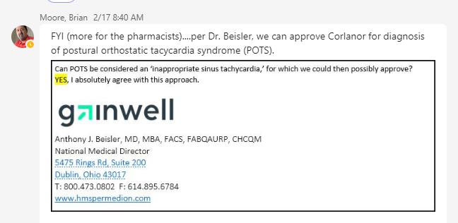

# Corlanor Criteria Guidance (10/30/23)

2/17/2023 from Brian Moore

FYI (more for the pharmacists)... per Dr.  Beisler, we can approve Corlanor for diagnosis of postural orthostatic tachycardia syndrome (POTS) (==potentially approved as long as preferred trials are tried (Corlanor is non-preferred as of 11/2/2023)==)

