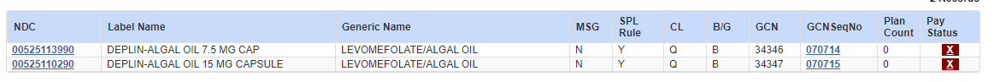
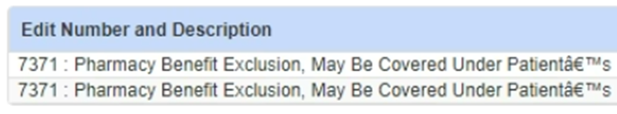
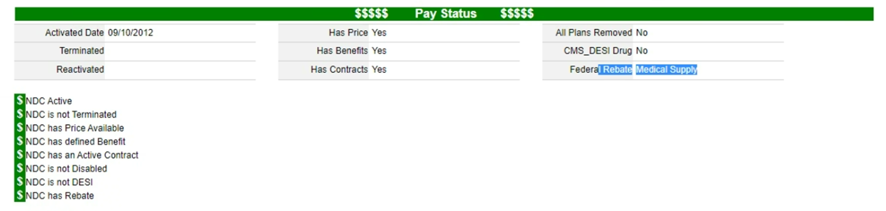
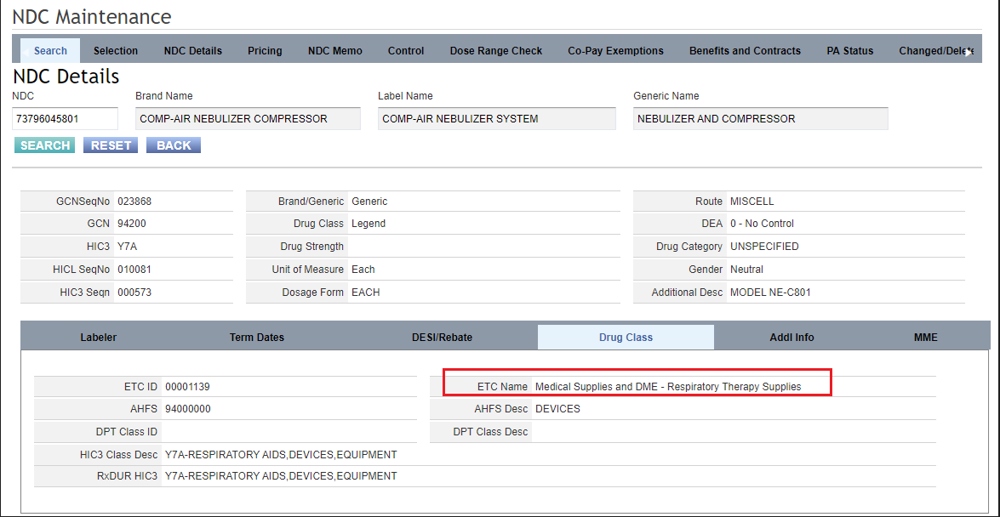
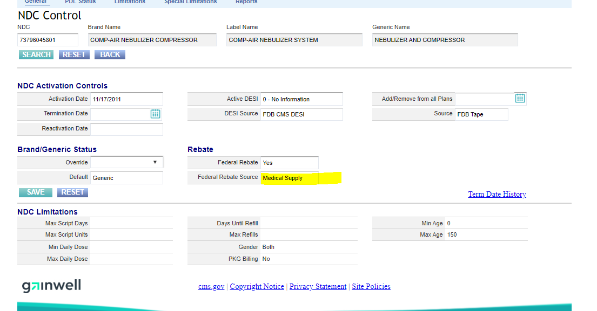

# DME and Medical food

## [Weekly email 7/2/23](https://mygainwell-my.sharepoint.com/:w:/g/personal/christopher_nguyen_gainwelltechnologies_com/EfRM6vvZbnRPlsW3CeTzA7QB4CMWZIGZP3G86X3lWWEYrw?e=DKe4Mx){:target="_blank" rel="noopener"}

•	Deplin – Please know that we ^^do not cover medical food.^^ If the folate product you are working on is said to be medical food per Lexicomp or is not indicated for product for that indication, please **admin deny**

Search: methylfolate, methyl-folate, levomefolate, l-folate

## EO Follow-up Deplin 7/13/23

Hello!
This is the specific GCN that was mentioned to not approve for medical food

I would strongly consider other formulations that do not have FDA indications or are medical food to ***not be EPSDT eligible.***

This is a general list of medical foods from Lexi with what they are normally used for, not indicated, but if on this list I would strongly recommend double checking indications and heavily scrutinize our payability of it
Medical Foods Product Table (Lexi-Drugs) - Lexicomp

As directed I would admindeny please,
Thanks
Justin

## DME

[Weekly email 7/22/23](https://mygainwell-my.sharepoint.com/:w:/r/personal/christopher_nguyen_gainwelltechnologies_com/Documents/weeklyemail72223.docx?d=w3fdfd9834de549a8b828b19b4ba6d456&csf=1&web=1&e=6w52v6){:target="_blank" rel="noopener"}

•	So hopefully a little more clarity for DME/Medical food situations that may come across our paths. **We do cover spacers and nebulizer masks, not the nebulizer/tubing itself.** ==We do NOT cover blood pressure cuffs or machines.==
When trying to contemplate if a product is a medical supply or benefit exclusion an edit that may pop and further description in NDC tile may help guide

If we do get what is perceived to be a DME product like diapers, nebulizers, nutritional supplements or caloric replacement like ensure or thickeners, blood pressure machines, medical food (other than deplin) to give the prescriber and patient the most information possible please provide **denial language** as in this scope:

==This product should be processed with the member’s durable medical equipment coverage.==

I am currently working on trying to get this more defined for ease of use and clear directives to be put in place for these situations.

## How to determine if a drug is a medical food in Vue360rx

[Weekly Email 8/26/23](https://mygainwell-my.sharepoint.com/:w:/g/personal/christopher_nguyen_gainwelltechnologies_com/EYnhUkLLPZVNt_4Yjl3mhZcBWApd5ZTU7TyrmNfHNgsyIQ?e=k57DKt){:target="_blank" rel="noopener"}

•	A further way we can tell what should be billed, but not always the most accurate are the following locations in the NDC Tile (please note not definitive, but may help in decisioning)

## Phlexy vitamins 8/5/23

[Weekly Email 8/5/23](https://mygainwell-my.sharepoint.com/:w:/r/personal/christopher_nguyen_gainwelltechnologies_com/Documents/weeklyemail8523.docx?d=w34551b8b7f674147b603832cab7090ca&csf=1&web=1&e=aTi6MU){:target="_blank" rel="noopener"}

•	Phexy vitamins have been a medication that has been identified as a medical food that ^^can be found to be approved under medical necessity^^

## Requests Needing to go to PNM

All FFS member requests for DME need to go to PNM.

