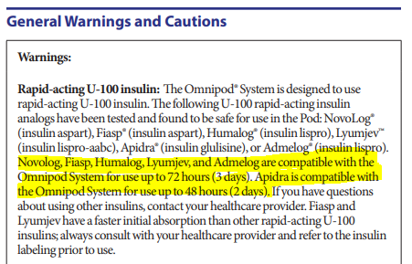

# Omnipod Quantity

## 11/6/23

[Weekly Email 11/05/23](https://mygainwell-my.sharepoint.com/:w:/g/personal/christopher_nguyen_gainwelltechnologies_com/EVQOOIEMRSZNoPwyja4M100BMFCNxrQlaxd8q_9vBmnvOA?e=wc27Fq){:target="_blank" rel="noopener"}

•	**Omnipod kits should be approved for ~~1/30~~**, and then the ^^pods should be approved for a year^^.

## Daily Dose Units 11/8/23

Team –

Moving forward, when reviewing a PA, please round up the calculated daily dose unit to the nearest whole number. After rounding up, remove the calculated “Quantity Dispensed” and hit the = sign to get the new calculated Quantity Dispensed.

Daily Dose Unit Examples:

- 0.001 = round up to 1
- 0.05 = round up to 1
- 0.2 = round up to 1
- 5.6 = round up to 6
- 13.25 = round up to 14

Thank you,

Cassandra Roach, PharmD, RPh

## 8/21/23

[Omnipod-System_User-Guide_English](https://www.omnipod.com/sites/default/files/2021-04/Omnipod-System_User-Guide_English.pdf){ :target="_blank" rel="noopener"}

8/21/23 [Weekly Email 8/19/23](https://mygainwell-my.sharepoint.com/:w:/g/personal/christopher_nguyen_gainwelltechnologies_com/EUlb6EUfKF5IiERwicJzc_MBynG7FCKq9KcwK59smLWgVA?e=x7Ez2D){:target="_blank" rel="noopener"}

Hi Justin-

We do not believe that we should approve all Omnipod PAs as 15 for 30 days.  Based on the Omnipod user guide, **the only drug listed that can only be used for up to 48 hours instead of 72 hours is Apidra**.  Also, it seems the FDA guidance relates to insulin pump, not specifically Omnipod. Hopefully, this helps but let us know if you think we need more clarification for the PA team.  Thanks!

## Clinical Notes

- Each pod can hold up to 200 units of ==U-100 insulin== 
- Each pod is good up to 72 hours
- **Exception** - ==Apidra is only good for 48hrs = 15 pods per month==

***Example:***

1. If a member is using 66 units OR less of U-100 insulin then 10 pods should last 30days
2. If a member is using 67-100 units of U-100 insulin then 15 pods should last 30 days

