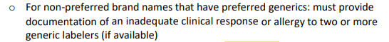

# Onfi (Clobazam) DAW Guidance 7/19/23

Team, 

Please disseminate the below communication to your teams ASAP. It is important that they are aware and have full understanding of how to handle brand name Onfi requests.

We have found that we are getting calls and PA requests for brand name Onfi (clobazam) are hitting for a rejection 7235 (DAW1 – Brand name necessary). When we get these requests it is imperative that we are looking at the member’s claims history (we should be looking at claims history for every PA and inbound call anyways). 

==Inbound calls== for **brand name Onfi:**

1.	If the member ^^has paid claims for brand name in the last 120 days^^, we should be placing the 7235 EO x 1 year to allow for payment if we get an inbound call. Please **document internally in the EO that the member is eligible for grandfathering of brand name due to paid claims within the last 120 days (please note the date of the most recent paid claim).**
   
2.	If there are ^^no paid claims for brand name in the last 120 days^^, look at the rejection to see why it is rejecting (it should be rejecting for both 7705 – PA required and 7235 – DAW1). Please advise the caller that a PA is required for brand name (take the verbal PA if applicable). 

==PA requests== for **brand name Onfi:**

1.	If the member ^^has paid claims for brand name in the last 120 days^^, the claim should only be rejecting for 7235 and we should be placing the **7235 EO x 1 year** to allow for payment. Once the EO is placed, please **internally note on the PA request the EO information and then send back as No PA required.**
   
2.	If there are ^^no paid claims for brand name in the last 120 days^^, note this in your internal notes and send to MEDREVIEW. Pharmacists: please review using the following:

 

Thank you,

Cassandra Roach, PharmD, RPh
