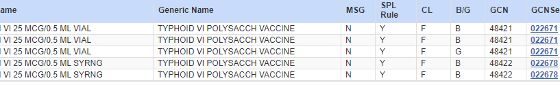
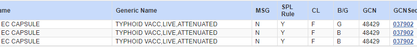

# Typhoid Vaccine 6/14/23

***Please see the guidance provided for Typhoid Vaccine:***

•	Requires a PA

•	Refer to Lexicomp for Labeled Indications and Dosing

•	Must meet CDC recommendation on when to administer Typhoid Vaccine (refer to the link provided)
        
- Vaccine Usage
        
Routine typhoid vaccination is not recommended in the United States.

Vaccination is recommended for the following groups:

  •	Travelers to areas where there is a recognized risk for exposure to Salmonella serotype Typhi (the most recent guidelines are available at http://wwwnc.cdc.gov/travel). Risk is greatest for travelers who have prolonged exposure to possibly contaminated foods and beverages, although short-term travelers are also at risk (6). Most travel-associated typhoid fever cases in the United States occur among travelers who are visiting friends or relatives; many travelers in this group do not seek pre-travel health care (19). Multidrug-resistant strains of Salmonella serotype Typhi have become common in many regions (8), and cases of typhoid fever that are treated with drugs to which the organism is resistant can be fatal. Travelers should be cautioned that typhoid vaccination is not a substitute for careful selection of food and beverages. Typhoid vaccines are not 100% effective, and vaccine-induced protection can be overwhelmed by large inocula of Salmonella serotype Typhi.

•	Persons with intimate exposure (e.g., household contact) to a documented Salmonella serotype Typhi chronic carrier (defined as excretion of Salmonella serotype Typhi in urine or stool for >1 year).

•	Microbiologists and other laboratory workers routinely exposed to cultures of Salmonella serotype Typhi or specimens containing this organism or who work in laboratory environments where these cultures or specimens are routinely handled.

### The drug file has been updated and the DESI and termed products should not be approved.

