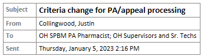

---
search:
  boost: 1
---

# Appeals 

[SPBM Member Handbook](https://spbm.medicaid.ohio.gov/SPDocumentLibrary/DocumentLibrary/Manuals/SPBM%20Member%20Handbook.pdf){:target="_blank" rel="noopener"}

[SPBM Pharmacy Reference Guide](https://spbm.medicaid.ohio.gov/SPDocumentLibrary/DocumentLibrary/User%20Guides/SPBM%20Pharmacy%20Reference%20Guide.pdf){:target="_blank" rel="noopener"}

## Appeals Process
[Appeals Processing Procedure- PENDING UPDATE 9/1/23](https://mygainwell-my.sharepoint.com/:w:/r/personal/christopher_nguyen_gainwelltechnologies_com/Documents/Evergreen/Emails/Appeals%20Processing%20for%20pharmacists.docx?d=w237c662b5a1642ca94477766772d1551&csf=1&web=1&e=gLLGJg){:target="_blank" rel="noopener"}

## Appeal Status Options

***9/1/23***: As we prepare to go live with the new WM system, we have a slight update of when to use each decision.   If you could send this to the pharmacists that work appeals I would appreciate it.  The main change is the use of Does Not Qualify.  

**Does Not Qualify**- Use this ONLY when you have a need for a letter that is not an Upheld status.  This is when we need to send a letter, for example, member is no longer active with a Medicaid plan. 

**Other** – can be used for anything else just need a note to document what is done, example, there is an approved PA on file now and does not need an appeal. 

**Overturned**- this means the case was overturned and a new PA went out. 

**Upheld** – this is for upheld appeals

**Withdrawn** – appeal is withdrawn, example, there is an approved PA on file now and does not need an appeal.

Lori Aliff 
Grievance and Appeals Supervisor 
Ohio SPBM

## Appeals during UPDL Changes

Hello,

As of 1/1/23 there have been updates to the UPDL, and it has been discussed what to do when something communicated prior to the implementation of the new criteria vs the old happens.
It has been decided that as of the time of the 30 day notice being posted vs actual implementation of the criteria can be used as a sort of leeway period for use of criteria that is to be vs prior.
 
If an appeal or PA comes in with backdating prior to this date, the date that the world was informed of the changes, then we use the criteria as before, which can be accessed at 
[https://pharmacy.medicaid.ohio.gov/sites/default/files/20221001%20UPDL_APPROVED_10.7.22.pdf#overlay-context=unified-pdl](https://pharmacy.medicaid.ohio.gov/sites/default/files/20221001%20UPDL_APPROVED_10.7.22.pdf#overlay-context=unified-pdl)

 
In the event of an appeal based on criteria that is changed as of 1/1/23 and is approvable now, we will uphold the initial decision, essentially denying the appeal based on information at the time and inform them that a new PA will be placed to replace the denied one, and then enter in the new PA with the date requested of the original that falls within the 30 day notice information.
 
Please for consistency’s sake we all must follow this process if it arises.

Any questions please ask,

Thanks,
 
Justin Collingwood
