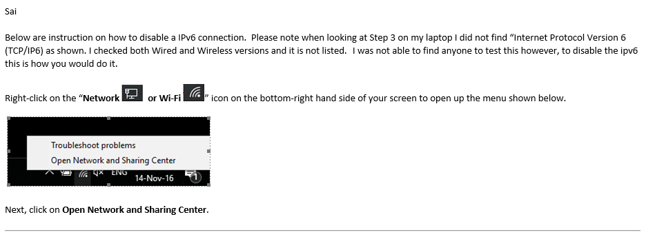
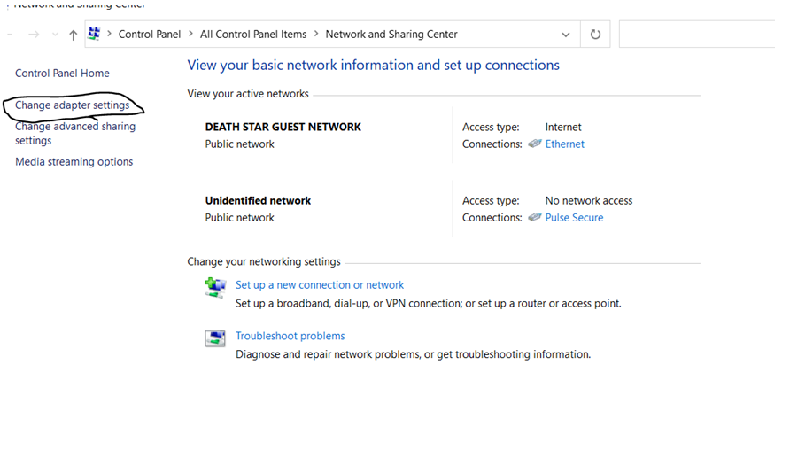
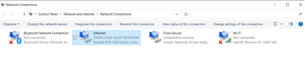
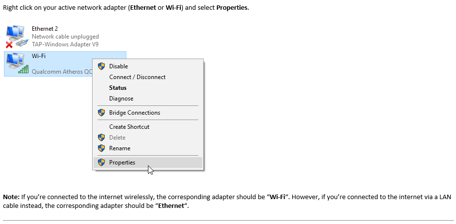
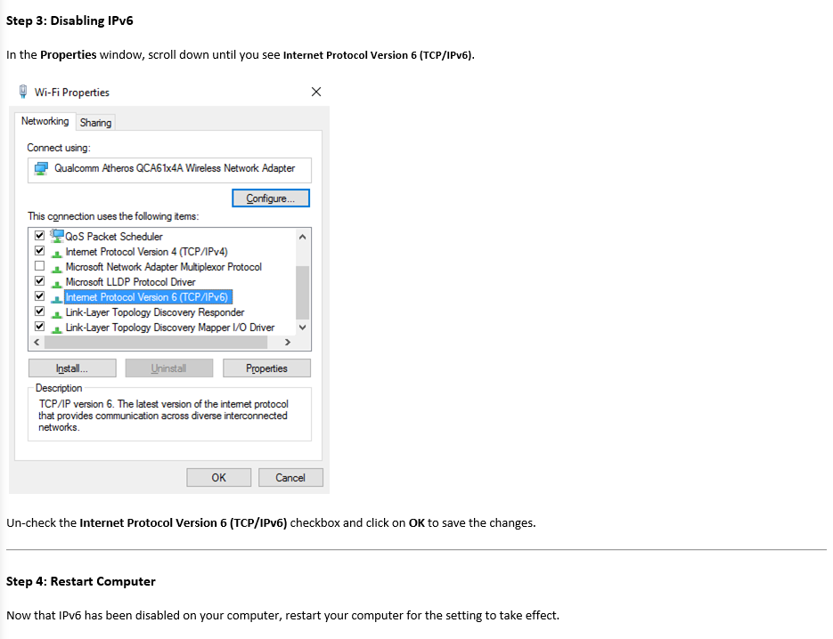

---
search:
  boost: 1
---

# Instructions to Disable IPv6 

Hello,

Here is a suggestion from IT/engineers on how to avoid time out/yellow screen of death.
I have not tried this yet, and am not aware if this will make things worse.

Thanks
Justin

Step 2: Change Adapter Settings

You will then see a list of network adapters available on your computer.

Michael 

Ohio MITS - Service Operations
