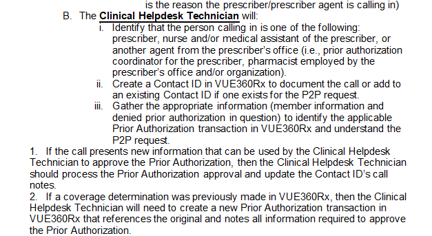

---
search:
  boost: 1
---

# Peer to Peer requests 

From tech chat 8/16/23

[Yesterday 11:10 AM] Collingwood, Justin

**Important!** Everyone ***Effective IMMEDIATELY*** – all P2P requests are to include 3 additional pieces of information: 

1. The reason the PA was denied per look up on Vue360RX.
2. The answers the prescriber has given to the reason it was denied.
3. The denying pharmacist. You are to approve those you can approve, and ^^you do not automatically send to pharmacists. You will do your responsibilities in the P2P process.^^

**Important!** Everyone ***Pharmacists*** – If these pieces of information are not in the P2P request, ignore until it is completed. Also ignore any urgent or vacation override requests. We in this chat know they do not belong here.

8/16/23- Email "Taking Responsibility"

Hello! We need to better tech processes. I have given warnings and brought training opportunities to light, and they are still not getting better with time.
This will no longer happen. I am collecting daily problems I will send out to the technician supervisors.
Situations I am seeing still.

1.	P2P – Per the DLP technicians must fully understand why the PA was denied and specifically focus on that information per our DLP.
   

This will be in every P2P posted in tech chat from now on:
              Reason for Denial on PA in VUE:
              Information gathered from prescriber when asked the specific reason it was denied:

I realize there may be some you will not be able to approve, but to save time and be more efficient, the pharmacist in tech chat can read the denial reason and if provided sufficient information if a PA can be approved, and the technician can enter that information and approve the PA in view, and stop it there.

This information will be collected.

**Pharmacists** -  you must clearly state in your denial language what you are missing on the path to approval.

There will not be an increase of straight to pharmacist or med director p2ps. I will look at those that are sent straight to the pharmacist and if the person on the other side of the phone does not specifically say “I want to speak to a pharmacist”, “I need the medical director”, “This needs to be reviewed by a pharmacist” are not said, I will be contacting quality. Situations that will no longer happen = “Let me get a hold of a pharmacist for you”, “We can do a peer to peer for this”(and not accepting the PA for yourself to handle) etc are not acceptable, you offer the service, you complete it.

WE are not cracking down on peer to peer numbers, I am cracking down on the PROCESSING of peer to peers, and how it needs to be better and follow the dlp. Every request still needs to be processed, the prescribers have that right.
Technicians should be able to approve common sense answers like “all they need is pulmonary hypertension diagnosis” or “if a TB test was done”. “I can’t approve this because a pharmacist denied” is and was never a viable reason, every denial will be coming from a pharmacist.

2.	PAs are still being segmented, many times it has been stated that this is as easy as hitting equals before submitting. This must happen, if approved for segmented it greatly hinders the ability to pick up medications.

3.	It is the responsibility of the technicians to verify first the member/prescriber/drug/diagnosis/MISSING signature(please notice the missing). The part of this is that drugs and diagnosis codes must be added, prescribers IDs and member ids and eligibilities must be verified and CURRENT. If member has primary or coordination of benefits issues, this does not come to medreview, ==even if a medreview auto drug==, coverage/eligibility determines the primary source of payment for this.

4.	Multiple faxes on one PA – this is a technician responsibility as well, it is on evergreen - [Splitting Faxes](https://special-spoon-f542dccd.pages.github.io/Pharmacist%20Reference%20Guide/Policy%20and%20Procedures/SPLITTING%20FAXES/?h=split) this is your responsibility to see that there are multiple faxes and to divide them appropriately.

5.	DO NOT simply take prior approved or denied PAs and send them to medreview. If a PA needs to have information provided or any other reason to be provided to decision, a new PA MUST be created.

I have, especially the peer to peer portion, reminded and reminded situations that have been happening and it does not seem to be sinking in. In efforts to push the responsibilities that are the technicians, the responsibility of coming outside of turn around time is going to be placed on the technician and their leads in these following situations.

==Starting Monday 8/21/23 9:00AM, the pharmacists will be doing the following for the numbered situations above:==

1.	If a peer to peer is lacking the two sentences I have put above and they are not correctly answered, Pharmacists do not acknowledge in chat with an emoji or message or begin working on that P2P until that information is added, if the call SLA is missed it is on the technician and their leads
2.	If a PA is segmented, Pharmacists do not fix it or work it, Immediately put in notes “segmented PA” switch status to pending and submit. If PA SLA is missed it is on the technician/technicians who seen it first through status log and their leads.
3.	If any of these situations occur in a PA that is in Medreview : ID’s do not match, missing diagnosis code or signature(no signature at all only), missing drug, Member has primary insurance or COB issues, immediately put in notes “incorrect/missing (dx, drug, primary insurance, eligibility)” whatever applies. Technicians need to handle these instances. Switch status to pending and hit submit. If PA SLA is missed on this PA, it is on the technician and their leads that moved it to medreview first.
4.	If a PA has 2 different faxes on a PA that need to be split, the pharmacist will put in notes “faxes need to be split” immediately switch status to pending, and hit submit. If this PA misses PA SLA, it is on the technician/technicians and their leads that were on the PA first per status log.
5.	If a PA that has been previously denied or approved and placed back in Medreview for some reason or another, the pharmacist will put in notes “misplaced rework”, change status to pending, and immediately hit submit. Technicians, If new information is provided or whatever reason a previously decisioned is placed in medreview, it must have a new PA created and accurate notes made. If urgent it goes in inprocess queue Whatever technician and their leads will take the responsibility of the error of placing this back into medreview.

Things need to get better, and they will get better, thank you for your cooperation in this and lets make this the best PBM out there!

Justin Collingwood

7/24/23 @ Technician Supervisors – please cascade this information to your teams ASAP. Please also place in Evergreen where appropriate.

It has been brought to our attention from providers that there is some confusion surrounding peer to peer requests. I am working on updating the current P2P DLP to prevent any confusion, but in the meantime, please ensure that we are:

1.	If a peer to peer request is needed with a pharmacist, it is the responsibility of the pharmacist who decisioned the PA to take the peer to peer call (whether it be immediately, or a call back). If the pharmacist who decisioned the case is not available (OOO, at lunch, etc.), it is the responsibility of the pharmacist in the chat to take the peer to peer. We should **ALWAYS** be performing the peer to peer when it is ^^convenient for the prescriber/provider^^ and not at our convenience (whether this be immediately or a call back – whichever the prescriber/provider prefers). Pharmacists are then to document the peer to peer interaction on the internal tracker.
   
2.	A technician should ^^NEVER^^ refuse to allow the provider to perform a peer to peer. It is on the denial letter for every provider that they have the right to perform a peer to peer. We have been told that technicians are advising that we are “cracking down” on the amount of peer to peers we are allowing – this is NOT the case! 

Most of the time, the provider is wanting to provide additional information to support the PA request via peer to peer (they are not just calling to complain). This takes time for the provider to do. As pharmacists taking the peer to peer, it is our responsibility to actively listen to any additional information that is provided and make a determination based off of this additional information. 

As soon as the DLP is updated, I will pass it along to the supervisors to uptrain staff accordingly.

Thank you for your assistance in this matter!

Cassandra Roach, PharmD, RPh

## Peer to Peer Reconsideration

[Peer to Peer and Reconsideration Process](https://mygainwell.sharepoint.com.mcas.ms/:w:/r/teams/OHSPBM/_layouts/15/Doc.aspx?sourcedoc=%7B45CA3683-3A81-4050-B775-EA8C41C2919D%7D&file=Peer%20to%20Peer%20and%20Reconsideration%20Process%20%20Updated%2005242023.docx&action=default&mobileredirect=true&cid=d388194a-3e49-4b4d-90b4-125226710d44){:target="_blank" rel="noopener"}

### Information to be attached for a P2P Medical Director Request

Dr. Wood asked me to remind the group to please include as much documentation as possible when sending him P2P requests. He does NOT have access to VUE360Rx; he is unable to see prior denials and/or subsequent upheld appeals. 

***Documentation should include the following:*** 

- name and DOB of member 
- provider name and phone number
- medical records (chart/progress notes, if available) 
- denial rationale (your note) 
- preferred medications (if applicable) 

Thank you.

___________________________________________
Brian Moore, BS, PharmD

