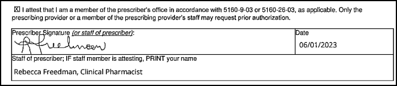
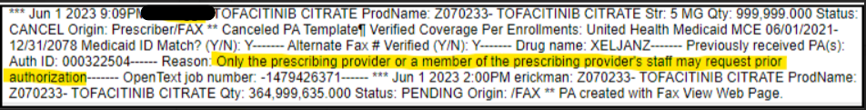

# PA Signatures

PA signatures

- ^^Signature only^^ (does not matter if we can read it) = ***accept*** (this is the prescriber submitting and box does NOT need checked)
- ^^Signature^^ and printed name = ***accept*** (this is prescriber submitting and box does NOT need checked)
- ^^Signature^^, printed name and box checked = ***accept*** (this is prescriber’s agent submitting since the box is checked)

- Nothing filled out and no box checked = ***Reject with fax back***
- No signature = ***Reject with fax back***
- Printed name only with no signature = ***Reject with fax back***
- Box checked and no signature or printed name = ***Reject with fax back***

Signature with job title indicating that they are an AGENT of the prescriber [Ex: PA specialist, RN, MA, LPN – does not apply to APRN or PA’s (Physician assistants)], printed name and no box checked = Reject with fax back
                Example:  
                

Signature with job title indicating that they are an AGENT of the prescriber [Ex: PA specialist, RN, MA, LPN – does not apply to APRN or PA’s (Physician assistants)],  no printed name and no box checked = Reject with fax back
                Example:  
                

Signature with job title indicating that they are an AGENT of the prescriber [Ex: PA specialist, RN, MA, LPN – does not apply to APRN or PA’s (Physician assistants)],  no printed name and box checked = Reject with fax back
                Example:  
                

### Reference

[weekly email 4/28/23](https://mygainwell-my.sharepoint.com/:w:/r/personal/christopher_nguyen_gainwelltechnologies_com/Documents/Evergreen/Emails/weeklyemail42823.docx?d=wc2d2297e447242f6a310e1aa4e002d2b&csf=1&web=1&e=G87tJQ){ .md-button .md-button--primary target="_blank" rel="noopener"}

## Additional info 6/1/23: Prescriber Names

[Prescriber Names](https://mygainwell-my.sharepoint.com/:u:/r/personal/christopher_nguyen_gainwelltechnologies_com/Documents/Evergreen/Emails/FW_%20Prescriber%20Names.msg?csf=1&web=1&e=ktMCCV){ .md-button .md-button--primary target="_blank" rel="noopener"}

Per Cassandra this is acceptable. Prescriber last name on the form, and NPI matches, please do not reject

Pharmacists and technicians:

Please advise all teams that under no circumstance should a PA be cancelled if a pharmacist is signing as the agent for the office. This continues to happen and will be an automatic failure from a quality standpoint moving forward for technicians and pharmacists. Often times pharmacists work in the office along side the provider and they are the authorized agent, similar to the nurse, MA, etc. Below is a recent example of another cancellation we have seen. ODM is continuing to call these out as well. We must correctly decision these ASAP.

