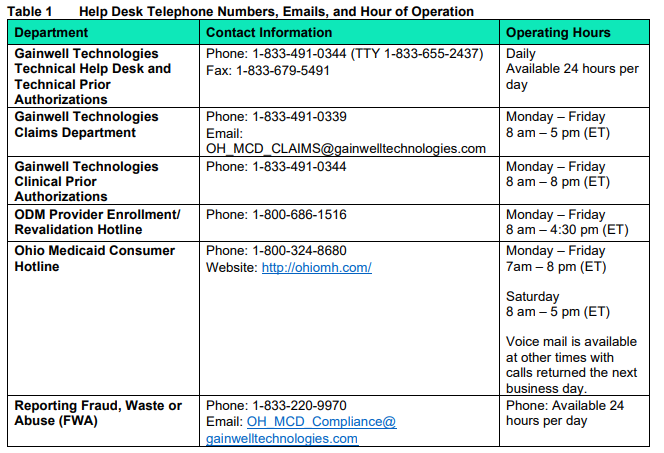
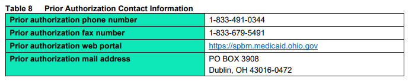
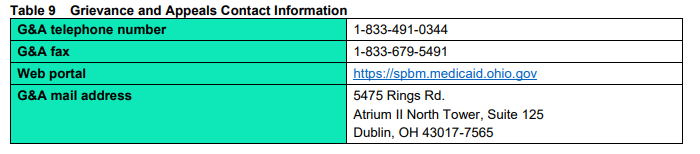
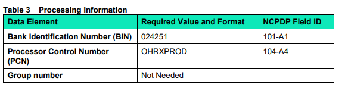
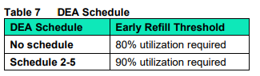
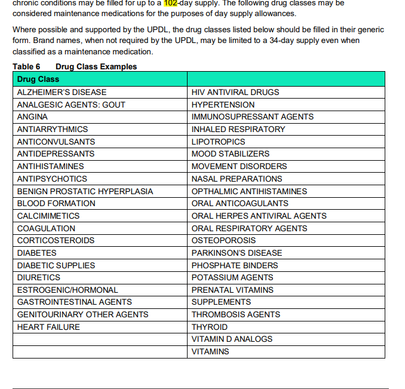

---
search:
  boost: 1
---

# Provider Reference Guide

[Provider Reference Guide](https://spbm.medicaid.ohio.gov/SPDocumentLibrary/DocumentLibrary/User%20Guides/SPBM%20Pharmacy%20Reference%20Guide.pdf){:target="_blank" rel="noopener"}

1.1.2 ODM Website Addresses The Ohio Medicaid Program [http://medicaid.ohio.gov](http://medicaid.ohio.gov)

The Ohio Medicaid Drug Program [http://pharmacy.medicaid.ohio.gov](http://pharmacy.medicaid.ohio.gov)

Ohio Medicaid Information Technology System (MITS) web portal [https://portal.ohmits.com/public/Providers](https://portal.ohmits.com/public/Providers)

The Gainwell Technologies SPBM portal and a searchable database of covered drugs [https://spbm.medicaid.ohio.gov](https://spbm.medicaid.ohio.gov) 1.1.3 

***Mailing Addresses*** 
Gainwell Technologies  
PO Box 3908 
Dublin, OH 43016-0472 

