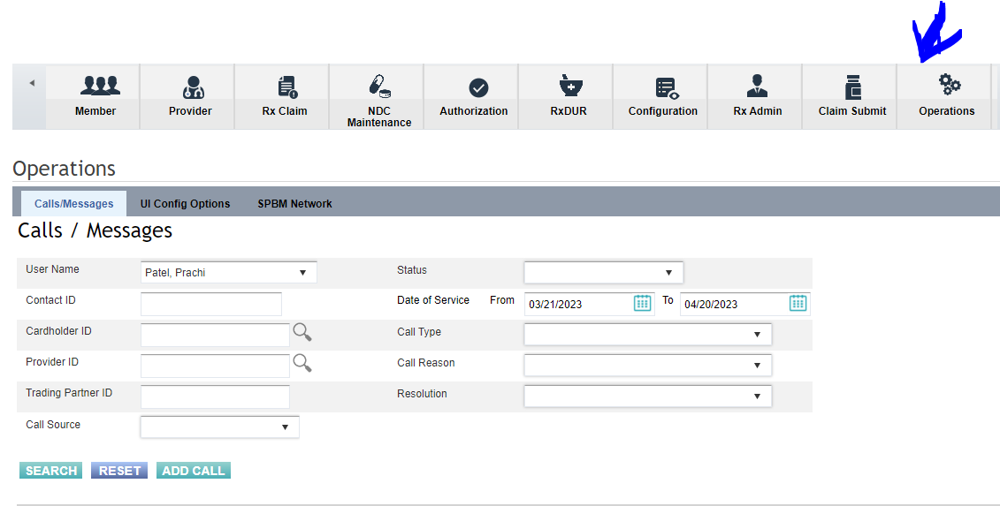

# Documenting a call

## Operations Tile/ Call notes

To log the note, we use the Operations Tile: 
 

Click on the "Add call" 

This is create a pop-up box: where you can select who you spoke with, for the most part it's provider for us.  

Provider ID is the NPI number 

You can select the best options: that pertain to the call topic from the dropdown menu: ex: 
 

 
Once you click through that, a box appears where you can type in the notes about the call, there is a template that the technicians use for their calls, we can use it also for consistency:  

Caller Name:       
Call back number:   
Member ID number:    
Reason for call:     
Resolution:  

Use one of the following Call Templates to enter your notes:  

**Members**: (Pharmacists will rarely take calls from Members): 

Caller Name:    
Call back number:    
Member ID number:   
Relation to member:   
Phone #:   
Address:   
Reason for call:   
Resolution:  

**Providers**: 

Caller Name:      
Call back number:   
Member ID number:    
Reason for call:     
Resolution:   

Once you type your notes, click Finish. and this should complete out the note. 

ALWAYS finish the note as RESOLVED/CLOSED.  

Once done, it will appear in your Operations window, with the call note number: 

 

 
