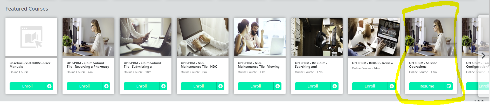

# Documenting a call

## P2P Call documentation

### Add a Call
Provider ID: **NPI of the Provider**  
Call Source: **Provider** 
Contact type: **Authorization**  
Contact Code: **Questions concerning obtaining authorization**

### Finish Provider Call:
Resolution Category: **Provider**  
Resolution: <ul><li>If the P2P is completed, **Satisfied Request**</li><li>If a message was left so a P2P is not completed, **No Resolution Code**</li></ul>

## Operations Tile/ Call notes

To log the note, we use the Operations Tile: 
 

Click on the "Add call" 

This is create a pop-up box: where you can select who you spoke with, for the most part it's provider for us.  

Provider ID is the NPI number 

You can select the best options: that pertain to the call topic from the dropdown menu: ex: 
 

 
Once you click through that, a box appears where you can type in the notes about the call, there is a template that the technicians use for their calls, we can use it also for consistency:  

Caller Name: 
Call back number: 
Member ID number:  
Reason for call:  
Resolution: 

Use one of the following Call Templates to enter your notes:  

**Members**: (Pharmacists will rarely take calls from Members): 

Caller Name:    
Call back number:    
Member ID number:   
Relation to member:   
Phone #:   
Address:   
Reason for call:   
Resolution:  

**Providers**: 

Caller Name:      
Call back number:   
Member ID number:    
Reason for call:     
Resolution:   

Once you type your notes, click Finish. and this should complete out the note. 

ALWAYS finish the note as RESOLVED/CLOSED.  

Once done, it will appear in your Operations window, with the call note number: 

## Operations Tile training 

[Operations Tile training doc email](https://mygainwell-my.sharepoint.com/:u:/g/personal/christopher_nguyen_gainwelltechnologies_com/EaZVv3837IpJnwJLNyV9uCoB0__0kxs_0YJsPzR0IMF8ZQ?e=zrRtXX){ .md-button .md-button--primary target="_blank" rel="noopener"}

[Operations Tile and ADD CALL Powerpoint](https://mygainwell-my.sharepoint.com/:p:/g/personal/christopher_nguyen_gainwelltechnologies_com/Ef2b2EZltLFJlkiHuTrlnVQBQtE2VHcEfM7lg5g-KggdGw?e=L4gRkK){:target="_blank" rel="noopener"}

[Contact ID Documentation PDF](https://mygainwell-my.sharepoint.com/:b:/g/personal/christopher_nguyen_gainwelltechnologies_com/ETyxzMOhl15Hi_DTX1GdOhYBs85xXox8ZBvKGFCw5FVT0A?e=UClEue){:target="_blank" rel="noopener"}

Good afternoon Justin,

Here is what we have for training on the operations tile. There is also a video they can watch on the LMS for the operations tile as well at [https://mmislearningcenter.myabsorb.com/.](https://mmislearningcenter.myabsorb.com/){:target="_blank" rel="noopener"}  Screenshot is below.

Regards,

Fernando Salvatierra
Professional Trainer

 

 
