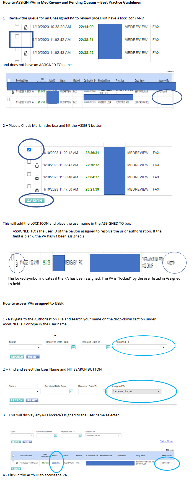
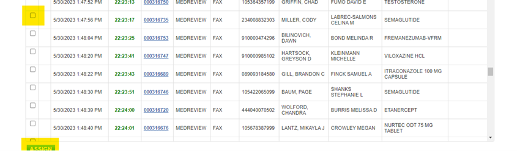
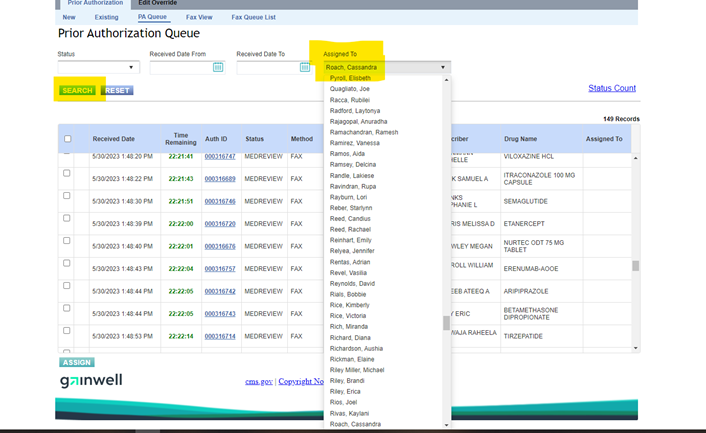
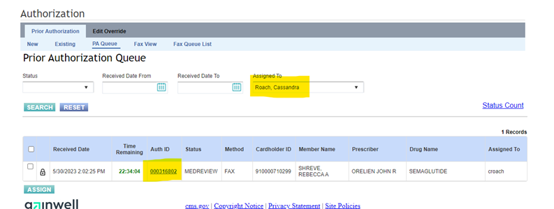

# Locking Cases Procedures 6/6/23

[Assigning PAs Best Practices](Assigning%20PAs%20Best%20Practice.pdf){:target="_blank" rel="noopener"}

[Locking Cases Email](URGENT%20-%20PLEASE%20READ%20AND%20ACT%20ON%20IMMEDIATELY%20.htm){ .md-button .md-button--primary target="_blank" rel="noopener"}

### (Archived) Locking cases (this process must be followed on EVERY CASE) in the Vue360Rx system 5/30/23

1.	Wait for the screen to refresh.

2.	Once the screen has refreshed, click the white box next to the case and hit “Assign” 

3. 	Once you have the case assigned to you, type your name in the “Assigned To” box and click “Search.” (this takes you to your individual bucket to work) ***Do not click your assigned case out of PENDING or MEDREVIEW queue. This MUST be done in your individual bucket.*** 

4.  ^^Once in your individual bucket/queue,^^ you can click the hyperlink to work the case.

