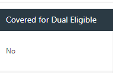

# OCC/COB Directions for Pharmacists

If the primary insurance being billed is ==Medicare or Member is Medicare Eligible AND the drug is listed as no in the drug
search for dual eligibles at OH SPBM== found here: NDC Search - [OH MCD SPBM.Web (ohio.gov)](https://spbm.medicaid.ohio.gov/PreferredDrugSearch/NDCSearch){:target="_blank" rel="noopener"}

==**ADMIN DENY**==

If the primary insurance is ==commercial or not Medicare==:

==**PROCESS AS IS, WE HAVE ASSURANCE THAT THE COMPUTER SYSTEM WILL COVER AS NECESSARY**==

