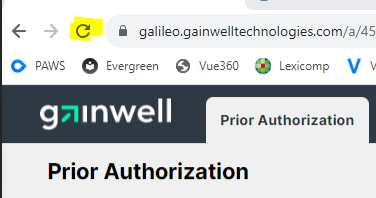
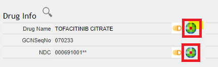

# Verint and Prior Authorization Workspace (PAWS)

[Verint Work Management Link](https://workmanagerprd.dxchcwfo.com/wm/app/#/dashboard){:target="_blank" rel="noopener"}

[CafeX/PAWS Link](https://galileo.gainwelltechnologies.com/a/45edee0a-be27-48e9-b747-d8289c6f054d/t/6f78ec36-8f4e-4ac3-8919-d9d493bed5f4/uf/c019640b-15ff-4ece-a590-557a1e9f6b0d){:target="_blank" rel="noopener"}

## Training Videos

[WM & PAWS Training Workshop Video 7/17/23](https://mygainwell.sharepoint.com/:v:/r/teams/aWFMReferenceCenter/Shared%20Documents/General/OH-SPBM%20Training/WM%20Recorded%20Training%20Sessions/WM%20Training%20Workshop-RPh.mp4?csf=1&web=1&nav=eyJyZWZlcnJhbEluZm8iOnsicmVmZXJyYWxBcHAiOiJTdHJlYW1XZWJBcHAiLCJyZWZlcnJhbFZpZXciOiJTaGFyZURpYWxvZyIsInJlZmVycmFsQXBwUGxhdGZvcm0iOiJXZWIiLCJyZWZlcnJhbE1vZGUiOiJ2aWV3In19&e=2OQuY2){:target="_blank" rel="noopener"} 

[Verint Work Manager- Powerpoint](https://mygainwell.sharepoint.com.mcas.ms/:p:/r/teams/aWFMReferenceCenter/_layouts/15/Doc.aspx?sourcedoc=%7B6804B0BF-6246-4C72-BEBB-4121F8EF9AC3%7D&file=OH-SPBM%20PA%20BOHB%20Agent%20Push%20the%20Button.pptx&action=edit&mobileredirect=true){:target="_blank" rel="noopener"}

[Operations Manager-Workspaces for Pharmacy PA Training Video](https://mygainwell.sharepoint.com.mcas.ms/teams/aWFMReferenceCenter/Shared%20Documents/Forms/AllItems.aspx?id=%2Fteams%2FaWFMReferenceCenter%2FShared%20Documents%2FOperations%20Manager%2DWorkspaces%20for%20Pharmacy%20PA%20training%2Emp4&parent=%2Fteams%2FaWFMReferenceCenter%2FShared%20Documents){:target="_blank" rel="noopener"}

## PAWS Tips 

- ***CTRL + W*** = Short key to close a tab after completion of a PA
- ***Browser Refresh button***- will reset the PA Queue back to default settings; when checking status count or checking your "assigned to" list (which will default back to this list upon completion of a PA), you can quickly go back to the main PA queue by hitting the browser "refresh" button to reset the settings

- Lexicomp searches: it is faster to click on the Lexicomp icon next to the drug name-> this will automatically search the drug name in Lexicomp on the Lexicomp tab vs clicking on the tab and doing a manual search. (combo drugs may not work by clicking the icon by the name but using the NDC icon should- this is being looked at by the developers)

## PAWS Suggestion

[PAWS Suggested Enhancements](https://mygainwell-my.sharepoint.com/:x:/g/personal/christopher_nguyen_gainwelltechnologies_com/Ecz0sPFbmZxKgg6T0_ZWSgkBO1l3XE1idLMnWu4rHK9YOw?e=CDoEen){:target="_blank" rel="noopener"}

### Password Reset

[Password Reset Link](https://hcpwreset.dxchcwfo.com/showLogin.cc){:target="_blank" rel="noopener"}

Username: "dxchcwfo\ " (usually first inital and last name)

### Reference link

[Sharepoint site](https://mygainwell.sharepoint.com.mcas.ms/teams/aWFMReferenceCenter/Shared%20Documents/Forms/AllItems.aspx?csf=1&web=1&e=T4mhxl&xsdata=MDV8MDF8fGI4NDdlZGRhMzRmMjQzNzZjNmE1MDhkYjg2ZmRmNWNifGM2NjNmODljZWY5YjQxOGZiZDNkNDFlNDZjMGNlMDY4fDB8MHw2MzgyNTIxOTc1MTE2Nzc2MDV8VW5rbm93bnxWR1ZoYlhOVFpXTjFjbWwwZVZObGNuWnBZMlY4ZXlKV0lqb2lNQzR3TGpBd01EQWlMQ0pRSWpvaVYybHVNeklpTENKQlRpSTZJazkwYUdWeUlpd2lWMVFpT2pFeGZRPT18MXxMMk5vWVhSekx6RTVPbTFsWlhScGJtZGZUVEpSZDFwRWF6Uk9lbWQwV21wU2JGbFRNREJPYlZVd1RGZEpNMDF0V1hST01sRjRUVzFWTkU5WFZYcE9WR3Q0UUhSb2NtVmhaQzUyTWk5dFpYTnpZV2RsY3k4eE5qZzVOakl5T1RVd01ETTF8NjMxYmNkODE4OGI1NDc2N2M2YTUwOGRiODZmZGY1Y2J8NGFlOTU1ZmUxZDllNGMzYTk3NzcwNzZiOTliOTgwOWM%3D&sdata=TEgvbVVkVEVmbEhmbkx6Z0tPOVFiMXBzc3Iyc1NhZ1U0UDJSVE5LNksrVT0%3D&ovuser=c663f89c%2Def9b%2D418f%2Dbd3d%2D41e46c0ce068%2Cchristopher%2Enguyen%40gainwelltechnologies%2Ecom&OR=Teams%2DHL&CT=1689623048206&clickparams=eyJBcHBOYW1lIjoiVGVhbXMtRGVza3RvcCIsIkFwcFZlcnNpb24iOiIyNy8yMzA2MDQwMTE3NyIsIkhhc0ZlZGVyYXRlZFVzZXIiOnRydWV9&cid=29214f2b%2Dabf9%2D4b16%2D8aa5%2D4972bb2edcd4&SafelinksUrl=https%3A%2F%2Fmygainwell%2Esharepoint%2Ecom%2Fteams%2FaWFMReferenceCenter%2FShared%2520Documents%2FGeneral%2FOH%2DSPBM%2520Training&RootFolder=%2Fteams%2FaWFMReferenceCenter%2FShared%20Documents%2FGeneral%2FOH%2DSPBM%20Training&FolderCTID=0x012000F4C2F1C29C3EFD46A2D00907A6620193){:target="_blank" rel="noopener"}
