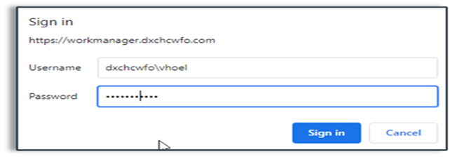
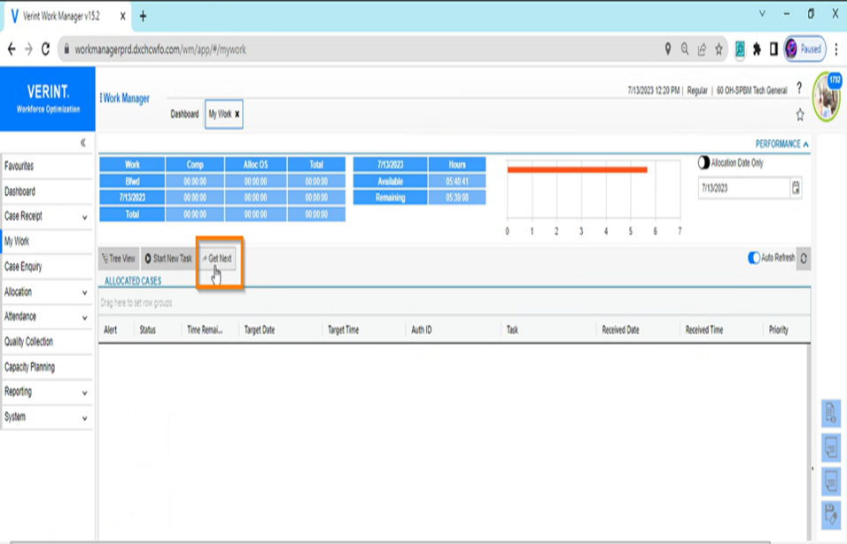
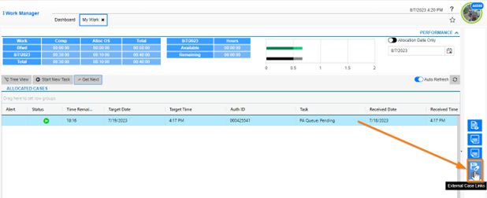
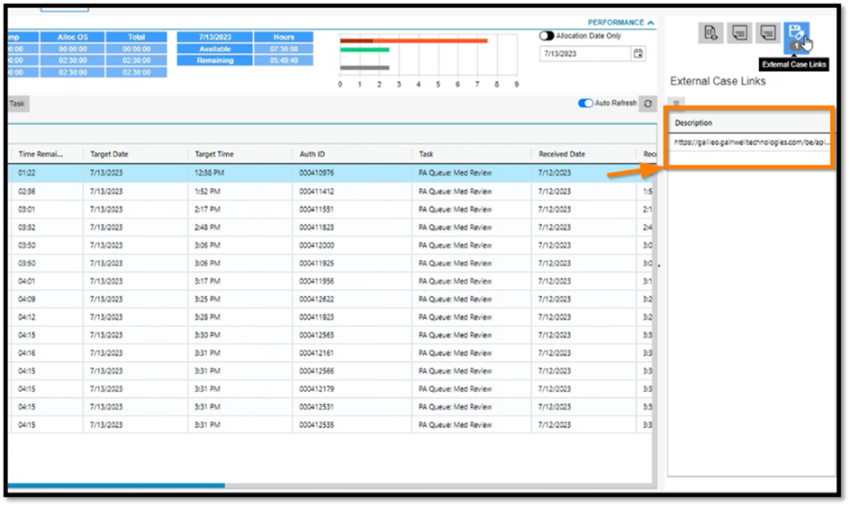
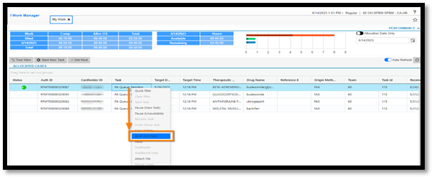
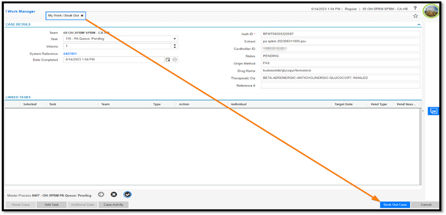
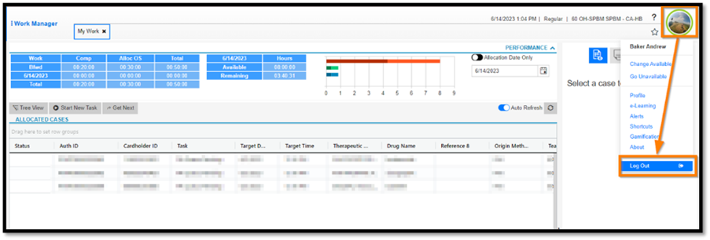
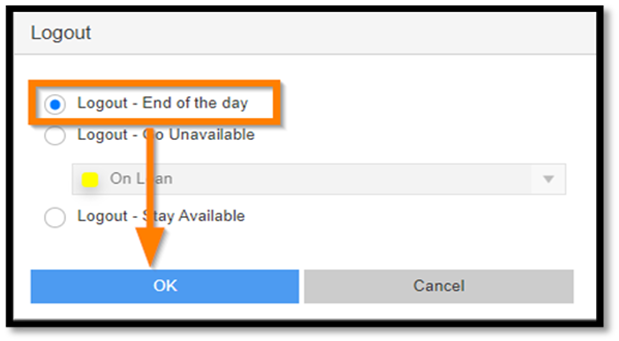
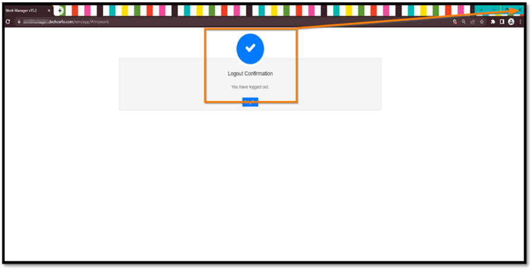

# WM Reference Guides

[WM Agent Training PowerPoint](https://mygainwell-my.sharepoint.com/:b:/g/personal/kaelyn_dobbins_gainwelltechnologies_com/ERwK5mbGrSpOkbVyo_NVkIkBQR-Htfo5rIY-C_vhbdtPWg?e=z0ad2W){ :target="_blank" rel="noopener" }

## WM Call Center/Team Lead Quick Reference Guide

[Reference Guide Document](https://mygainwell-my.sharepoint.com/:w:/g/personal/kaelyn_dobbins_gainwelltechnologies_com/EcKPEAs-wD1Eq3VNVNMAU4oBMx3bBtDImDQITN2AKzyU4g?e=g545lE){ :target="_blank" rel="noopener" }

| Action | Steps | Example or Screenshot |
| :----- | :---- | :-------------------- |
| Reset Password | Save this link as a bookmark for future password changes | [https://hcpwreset.dxchcwfo.com/showLogin.cc](https://hcpwreset.dxchcwfo.com/showLogin.cc){ :target="_blank" rel="noopener" } |
| Logging in to WM | Use and Save the URL in <b>Google Chrome</b>   Ensure you have dxchcwfo\ in front of your username | [https://workmanagerprd.dxchcwfo.com/WM/app](https://workmanagerprd.dxchcwfo.com/WM/app){ :target="_blank" rel="noopener" }   |
| Starting a PA-CC or TL | Left click My Work from the Menu on the left side of your WM screen.    Left click on the Get Next button.    A green arrow appears in the Status column on WM indicating you have started work on the PA    REMEMBER: You will see the PAs locked down for you on the My Work screen in the allocated cases section. You no longer lock down PAs in Vue360Rx. |  |
| Accessing the PA in PAWS | Left click the bottom blue icon on the right-hand side of the page to display the External Case Links panel.    This will display the URL for you to click to go to Gainwell Workspaces (PAWS) |     |
| Booking out a PA | <b>Right click</b> on the PA and </b>select</b> "Book Out Case" from the pop out menu to display the Book Out window.    The My Work/Book Out window will open.    Cont'd Left click on the blue Book Out Case button in the lower right-hand corner of the screen |     |
| Logging Out | <b>REMEMBER-if you have any PAs in your "My Work" screen, you must let your Snr. Tech or Supervisor know before you go offline.</b>    Click on the attendance profile icon in the top right of the screen.    You will see a drop-down menu appear with your name at the top of the list. Select "Log Out" at the bottom of that menu.    You must make sure you see the check mark and the message "Logout Confirmation".    Once you see this, </u>be sure to close the CHROME browser</u> and shut down your PC as usual. |        |
| Additional training | <b>Select the Call Center Training link</b> | [Call Center Training](https://mygainwell.sharepoint.com.mcas.ms/teams/aWFMReferenceCenter/Shared%20Documents/Forms/AllItems.aspx?csf=1&web=1&e=7qF09f&cid=8305b3fe%2D93d6%2D405b%2Dac9d%2Dd22ee538e081&RootFolder=%2Fteams%2FaWFMReferenceCenter%2FShared%20Documents%2FGeneral%2FOH%2DSPBM%20Training%2FCall%20Center%20Training&FolderCTID=0x012000F4C2F1C29C3EFD46A2D00907A6620193){ :target="_blank" rel="noopener" }   OH-SPBM CC Agent Push the Button Training PP with FAQ Operations Manager-Workspaces for Pharmacy (PAWS) training video   <u><b>WM Recorded Training Sessions</b></u> [WM & PAWS Training Workshop-General Call Center](https://mygainwell.sharepoint.com/:v:/r/teams/aWFMReferenceCenter/Shared%20Documents/General/OH-SPBM%20Training/WM%20Recorded%20Training%20Sessions/WM%20%26%20PAWS%20Training%20Workshop-General%20Call%20Center.mp4?csf=1&web=1&e=ZS0ECl&nav=eyJyZWZlcnJhbEluZm8iOnsicmVmZXJyYWxBcHAiOiJTdHJlYW1XZWJBcHAiLCJyZWZlcnJhbFZpZXciOiJTaGFyZURpYWxvZyIsInJlZmVycmFsQXBwUGxhdGZvcm0iOiJXZWIiLCJyZWZlcnJhbE1vZGUiOiJ2aWV3In19){ :target="_blank" rel="noopener" } |